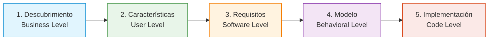

# Manual Técnico y Operativo del Backend de KOSMO para Agentes de IA

> **Destinatario:** Agentes de IA y desarrolladores senior que operen, mantengan o extiendan el backend de KOSMO.
> **Ubicación:** `backend/AGENTS.md`
> **Fuente de Verdad:** Código fuente en `src/kosmo/`, pruebas en `tests/` y configuración del repositorio.
> **Principio Rector:** Simplicidad, minimalismo, pragmatismo y YAGNI bajo Arquitectura Hexagonal estricta.

---

## Índice

1. [Visión General y Propósito del Sistema](#1-visión-general-y-propósito-del-sistema)
2. [Principios de Diseño y Desarrollo: Simplicidad y YAGNI](#2-principios-de-diseño-y-desarrollo-simplicidad-y-yagni)
3. [Arquitectura Hexagonal y Reglas de Capas](#3-arquitectura-hexagonal-y-reglas-de-capas)
4. [Stack Tecnológico y Dependencias Clave](#4-stack-tecnológico-y-dependencias-clave)
5. [Estructura Exhaustiva del Código Fuente](#5-estructura-exhaustiva-del-código-fuente)
6. [Ciclo de Vida de la Aplicación y Request Flow](#6-ciclo-de-vida-de-la-aplicación-y-request-flow)
7. [Dominio SDD: Pipeline de Fases y Artefactos](#7-dominio-sdd-pipeline-de-fases-y-artefactos)
8. [Sistema de Agentes: KOSMOAgent y Componentes](#8-sistema-de-agentes-kosmoagent-y-componentes)
9. [Catálogo de Phase Modes y Prompts del Sistema](#9-catálogo-de-phase-modes-y-prompts-del-sistema)
10. [Catálogo Exhaustivo de Skills](#10-catálogo-exhaustivo-de-skills)
11. [Catálogo Exhaustivo de Tools](#11-catálogo-exhaustivo-de-tools)
12. [Sistema de Chat, Sesiones y Modificaciones](#12-sistema-de-chat-sesiones-y-modificaciones)
13. [Consistencia y Trazabilidad (Right-Only Cascade)](#13-consistencia-y-trazabilidad-right-only-cascade)
14. [Generación de Código (Codegen & OpenCode)](#14-generación-de-código-codegen--opencode)
15. [Sistema de Streaming SSE y Event Broker](#15-sistema-de-streaming-sse-y-event-broker)
16. [Persistencia, Modelos ORM y Base de Datos](#16-persistencia-modelos-orm-y-base-de-datos)
17. [Capa API, Routers y Endpoints](#17-capa-api-routers-y-endpoints)
18. [Seguridad, Criptografía y Control de Acceso](#18-seguridad-criptografía-y-control-de-acceso)
19. [Testing y Estrategia de Pruebas](#19-testing-y-estrategia-de-pruebas)
20. [Configuración y Variables de Entorno](#20-configuración-y-variables-de-entorno)
21. [Manual Operativo para Agentes: Reglas de Modificación](#21-manual-operativo-para-agentes-reglas-de-modificación)

---

## 1. Visión General y Propósito del Sistema

KOSMO es una plataforma de **Spec-Driven Development (SDD)** (*Desarrollo Guiado por Especificaciones*) asistida por Inteligencia Artificial. Su objetivo fundamental es transformar una idea de negocio en una aplicación web funcional, testeada y desplegable, garantizando trazabilidad rigurosa y consistencia en cascada unidireccional (*downstream-only / right-only*) en cada etapa.

El pipeline central se compone de cinco fases secuenciales e interconectadas:
1. **Descubrimiento (Business Level):** Definición del problema, espacio de valor, actores, metas medibles y reglas de negocio estructurado en **exactamente 7 secciones canónicas de Markdown** (`DISCOVERY_SECTIONS`).
2. **Características (User Level):** Desglose del producto en capacidades de interacción del usuario codificadas secuencialmente (`C01`, `C02`, ...), con títulos de acción breves (máximo 6 palabras), descripción de interacción de 1-2 oraciones y justificación trazable a las secciones del Descubrimiento.
3. **Requisitos (Software Level):** Especificación formal del comportamiento del software bajo notación **EARS** (*Easy Approach to Requirements Syntax*), clasificados en 6 patrones formales con criterios de aceptación estructurados en formato **Given-When-Then (GWT)**.
4. **Modelo (Behavioral Level):** Diagramas de actividad en sintaxis moderna PlantUML estructurados por swimlanes (máximo 4 carriles y 20 nodos de acción) que modelan los flujos de decisión y control del sistema.
5. **Implementación (Code Level):** Generación autónoma de código frontend en Next.js 16 (App Router), React 19, TypeScript estricto, Drizzle ORM (SQLite) y Vitest mediante agentes headless de OpenCode, con bucle de validación y auto-reparación determinista y sincronización a GitHub/Railway.

---

## 2. Principios de Diseño y Desarrollo: Simplicidad y YAGNI

Todo agente que interactúe con el backend de KOSMO debe regirse por principios de ingeniería pragmáticos y minimalistas (Senior Pragmatic Dev):

```
                       LA ESCALERA DE DECISIÓN (THE LADDER)

           1. ¿Necesita existir? (YAGNI) ──> Si no se requiere, OMITIRLO.
           2. ¿Ya existe en el código?  ──> REUTILIZAR funciones/tipos existentes.
           3. ¿La stdlib lo resuelve?   ──> Usar standard library de Python 3.12+.
           4. ¿La plataforma lo cubre?  ──> Usar capacidades nativas SQL/OS/HTTP.
           5. ¿Una dependencia lo hace? ──> Usar libs instaladas (FastAPI, Pydantic).
           6. ¿Puede ser una línea?     ──> Escribir UNA línea.
           7. Solo entonces:            ──> Escribir el mínimo código indispensable.
```

### Reglas Innegociables de Simplicidad:
- **Cero abstracciones prematuras:** Prohibido crear interfaces o clases abstractas para componentes con una sola implementación concreta, fábricas genéricas no solicitadas o wrappers innecesarios.
- **Diff mínimo y preciso:** Las soluciones con menor cantidad de archivos tocados y menor volumen de líneas modificadas siempre tienen prioridad.
- **Corrección en la causa raíz:** Ante un bug, identificar el origen compartido y colocar un guard o corrección ahí, nunca dispersar parches defensivos en múltiples llamadas.
- **Límites de confianza protegidos:** Nunca flexibilizar la validación de esquemas (Pydantic), el control de acceso (IDOR/JWT), la protección criptográfica ni el manejo de errores en persistencia.

---

## 3. Arquitectura Hexagonal y Reglas de Capas

El backend adopta una **Arquitectura Hexagonal (Ports & Adapters)** estricta, verificada en CI mediante `import-linter` (definido en [backend/.importlinter](file:///c:/projects/KOSMO/backend/.importlinter)).

```
┌────────────────────────────────────────────────────────────────────────┐
│                        INFRASTRUCTURE LAYER                            │
│  API (FastAPI, Routers, Middlewares, SSE, RFC 7807)                   │
│  Persistence (PostgreSQL async, SQLAlchemy 2.0, UoW, Redis, Outbox)   │
│  LLM (DynamicUserLLMClient, PydanticAI Adapter, Embedders, Tools)      │
│  Codegen (Workspace Manager, Isolated OpenCode, OpenCode Client)      │
│  Security (Fernet Vault, JWT Codec RS256, Argon2id Hasher)             │
│  Sandbox (Subprocess, Docker, Remote Code Runners)                     │
│  Integrations (GitHub Client, Railway Client, Deployment Worker)       │
└───────────────────────────────────┬────────────────────────────────────┘
                                    │  depende de
                                    ▼
┌────────────────────────────────────────────────────────────────────────┐
│                         APPLICATION LAYER                              │
│  Pipeline (KOSMOAgent, ContextBuilder)                                 │
│  Codegen (GenerateFeatureImplementation, Planning, Build, Validate)   │
│  Chat (ProcessChatMessage, ProcessChatModification)                   │
│  Consistency (EvaluateConsistency, ApplyConsistencyImpacts)            │
│  Use cases (Auth, Discovery, Features, Requirements, Modelo, etc.)     │
└───────────────────────────────────┬────────────────────────────────────┘
                                    │  depende de
                                    ▼
┌────────────────────────────────────────────────────────────────────────┐
│                           DOMAIN LAYER                                 │
│  Pipeline (Phase Modes, Phase Validators, Shared Prompts, Registries)  │
│  SDD (IdGenerator, Guardrails, Converters, Diffs, Parsers, EARS/UML)   │
│  Codegen (Integration Rules, Path Safety, Plan Rules, Token Linter)    │
│  Auth (PKCE logic) & Agent Memory (Session Factory)                    │
└───────────────────────────────────┬────────────────────────────────────┘
                                    │  depende de
                                    ▼
┌────────────────────────────────────────────────────────────────────────┐
│                          CONTRACTS LAYER                               │
│  DTOs inmutables (frozen dataclasses, Pydantic schemas)                │
│  Puertos abstractos (typing.Protocol runtime_checkable)                │
│  Identificadores opacos fuertemente tipados (NewType IDs)              │
│  Jerarquía canónica de errores (SpecError con RFC 7807 ProblemDetail)  │
│  Enums fundamentales (SpecPhase, AIProvider, TokenType, etc.)         │
└────────────────────────────────────────────────────────────────────────┘
```

### Reglas de Dependencia Direccional:
- `infrastructure` -> `application` -> `domain` -> `contracts`
- `contracts` **NUNCA** importa de `domain`, `application` o `infrastructure`.
- `domain` **NUNCA** importa de `application` o `infrastructure`.
- `application` **NUNCA** importa de `infrastructure`. Consume exclusivamente puertos de `contracts/`.

---

## 4. Stack Tecnológico y Dependencias Clave

| Categoría | Tecnología / Librería | Versión | Propósito Técnico |
|---|---|---|---|
| **Lenguaje** | Python | `>=3.12` | Runtime base fuertemente tipado (`type`, `TypeVar`, `NewType`). |
| **Framework Web** | FastAPI | `^0.115.0` | API REST asíncrona, validación de esquemas y streaming SSE. |
| **Servidor ASGI** | Uvicorn (uvloop) | `^0.34.0` | Servidor HTTP de alto rendimiento. |
| **Modelos y Schemas** | Pydantic v2 | `^2.10.0` | Serialización, deserialización y contratos estructurados de LLM. |
| **Framework LLM** | PydanticAI | `^0.0.18` | Invocación estructurada tipada (`complete_typed`) y agentes LLM. |
| **Base de Datos** | PostgreSQL + asyncpg | PostgreSQL 16 | Almacenamiento relacional asíncrono con extensión `pgvector`. |
| **ORM** | SQLAlchemy 2.0 async | `^2.0.36` | Mapeo objeto-relacional y consultas asíncronas con Unit of Work. |
| **Migraciones** | Alembic | `^1.14.0` | Control de versiones del esquema de base de datos. |
| **Caché y Mensajería**| Redis (redis-py async)| `^5.2.0` | Rate limiting con Lua, rotación de tokens y broker de implementación. |
| **Criptografía** | Cryptography (Fernet) | `^44.0.0` | Cifrado simétrico AES-128-CBC + HMAC-SHA256 para API keys BYOK. |
| **Hashing Claves** | Argon2-cffi | `^23.1.0` | Hashing robusto de contraseñas de usuario (OWASP 2025). |
| **JWT** | python-jose (cryptography) | `^3.3.0` | Tokens RS256 con claves asimétricas RSA PEM. |
| **Identificadores** | python-ulid | `^3.0.0` | IDs de 128 bits lexicográficamente ordenables con prefijo de entidad. |
| **Observabilidad** | Structlog, OpenTelemetry, Logfire | Modern telemetry | Tracing distribuido, logs estructurados JSON y métricas Prometheus. |
| **Cliente HTTP** | HTTPX | `^0.28.1` | Cliente asíncrono para OpenCode, GitHub y Railway. |
| **Herramientas Dev** | uv, ruff, pyright, pytest | Modern tooling | Gestión de paquetes, linter, formateador y type-checking estricto. |

---

## 5. Estructura Exhaustiva del Código Fuente

El código del backend reside íntegramente en `src/kosmo/`:

```text
src/kosmo/
├── __init__.py
├── config.py                                 # Settings validados de entorno (Pydantic Settings)
├── contracts/                                # Capa 1: Puertos, DTOs, Enums y Errores
│   ├── __init__.py                           # Fachada pública (120+ símbolos exportados)
│   ├── telemetry.py                          # Puerto TelemetryPort y decorador @traced
│   ├── ai/                                   # Bounded context IA, Chat y Consistencia
│   │   ├── ai_config.py                      # AIProvider, UserAiConfig, repositorios
│   │   ├── chat.py                           # ChatRole, MensajeChat, HistorialChat, ChatRepository
│   │   └── consistency.py                    # DOWNSTREAM_TARGETS, ConsistencyEvaluation, puertos
│   ├── audit/                                # Bounded context Auditoría
│   │   ├── events.py                         # AuditEvent, AuditOutcome
│   │   └── ports.py                          # AuditEventSink protocol
│   ├── auth/                                 # Bounded context Autenticación y Criptografía
│   │   ├── context.py                        # ContextVar current_user_id
│   │   ├── errors.py                         # Jerarquía AuthError (TokenExpired, AccountLocked, etc.)
│   │   ├── pkce.py                           # AuthorizationCode, PkceMethod S256
│   │   ├── ports.py                          # TokenIssuer, TokenVerifier, PasswordHasher, repos
│   │   ├── principal.py                      # Principal (subject + scopes + comodín "*")
│   │   ├── secrets.py                        # EncryptedSecret, SecretCipher protocol
│   │   ├── tokens.py                         # TokenType, IssuedToken, TokenPair, TokenClaims
│   │   └── users.py                          # User entity inmutable
│   ├── integrations/                         # Bounded context Integraciones Externas
│   │   ├── deployment.py                     # DeploymentProvider, DeploymentStatus, Railway ports
│   │   ├── git.py                            # GitWorkspacePort protocol
│   │   ├── github.py                         # GitHubClientPort, repositorios y entidades
│   │   └── user_integration.py               # IntegrationProvider, UserIntegration, repo
│   ├── llm/                                  # Bounded context LLM y Embeddings
│   │   └── ports.py                          # LLMClient, Embedder, PromptTemplate, LLMResponse
│   ├── memory/                               # Bounded context Memoria del Agente
│   │   ├── agent_memory.py                   # AgentSession, AgentMemoryPort, KnowledgePatternStore
│   │   └── user_preference.py                # UserPreference entity
│   ├── persistence/                          # Bounded context Transaccional
│   │   └── persistence.py                    # UnitOfWork protocol, OutboxPort
│   ├── pipeline/                             # Bounded context Orquestación SDD
│   │   ├── consistency_phase_context.py      # ConsistencyPhaseContext
│   │   ├── orchestrator_ports.py             # PhaseMode, Skill, AgentPort protocols
│   │   ├── phase_contexts.py                 # 12 contextos tipados de fase
│   │   ├── phase_errors.py                   # PhaseTransitionError, PhaseNotSupportedError
│   │   └── phase_outputs.py                  # ValidationResult, DTOs de salida, esquemas Pydantic
│   └── sdd/                                  # Bounded context SDD Core
│       ├── activity_diagram.py               # DiagramaActividad entity
│       ├── codegen.py                        # Contratos de Codegen, OpenCode, CodeRunner, Workspace
│       ├── document.py                       # RichTextDocument AST, SpecPhase, EARSPattern
│       ├── ears.py                           # EARSRequirement entity
│       ├── errors.py                         # SpecError base con RFC 7807 ProblemDetails
│       ├── feature.py                        # Feature entity
│       ├── guardrails.py                     # PROHIBITED_TERMS, DISCOVERY_SECTIONS
│       ├── ids.py                            # 12 NewType IDs (ProjectId, FeatureId, etc.)
│       └── repositories.py                   # Protocolos de repositorios SDD principales
├── domain/                                   # Capa 2: Lógica de Dominio Pura (Cero I/O)
│   ├── auth/pkce.py                          # Generación y validación de challenges PKCE S256
│   ├── agent_memory/session_factory.py       # Factory de sesiones de agente
│   ├── codegen/                              # Dominio de Generación de Código
│   │   ├── integration_rules.py              # Reglas de disposición (CREATE, EXTEND, INTEGRATE)
│   │   ├── palette_generator.py              # Generador de paletas OKLCH y tokens Bootstrap 5
│   │   ├── parse_validation_output.py        # Parsers regex para tsc, eslint, vitest, next build
│   │   ├── path_safety.py                    # Validación estricta anti directory-traversal
│   │   ├── plan_rules.py                     # Reglas de protección de archivos del workspace
│   │   ├── registry_edit.py                  # Edición del registro de features (feature-registry.ts)
│   │   ├── site_config.py                    # Generación de site.ts, design-tokens.ts, globals.css
│   │   ├── structural_validator.py           # Validación estructural de slices según disposición
│   │   └── token_linter.py                   # Detección de clases Tailwind y colores hex prohibidos
│   ├── pipeline/                             # Dominio del Pipeline de Fases
│   │   ├── _dict_utils.py                    # Sanitización de dicts y extracción de requisitos
│   │   ├── feature_resolver.py               # Resolución asíncrona ID/slug -> FeatureId
│   │   ├── knowledge_tool_registry.py        # Registro in-memory de tools de lectura para el LLM
│   │   ├── phase_detector.py                 # Detección heurística de mismatch de fase en chat
│   │   ├── skill_registry.py                 # Catálogo in-memory de skills (Skill -> PhaseMode)
│   │   ├── phase_modes/                      # Implementaciones de PhaseMode por fase
│   │   │   ├── base_chat_mode.py             # Clase base para modos de chat interactivo
│   │   │   ├── discovery_mode.py             # Generación de Descubrimiento
│   │   │   ├── discovery_refine_mode.py      # Refinamiento quirúrgico de Descubrimiento
│   │   │   ├── discovery_chat_mode.py        # Chat sobre Descubrimiento
│   │   │   ├── features_mode.py              # Generación de Características
│   │   │   ├── features_chat_mode.py         # Chat sobre Características
│   │   │   ├── ears_mode.py                  # Generación de Requisitos EARS
│   │   │   ├── requirements_chat_mode.py     # Chat sobre Requisitos
│   │   │   ├── requirements_refine_mode.py   # Refinamiento de Requisitos EARS
│   │   │   ├── modelo_mode.py                # Generación de Diagramas PlantUML
│   │   │   ├── consistency_evaluation_mode.py# Evaluación y corrección de impacto downstream
│   │   │   └── direct_modification_mode.py   # Modificación directa de documentos
│   │   ├── phase_validators/                 # Validadores puros de fase
│   │   │   ├── discovery_validator.py        # Validación de estructura y calidad de Descubrimiento
│   │   │   ├── discovery_refine_validator.py # Validación de nivel de negocio tras refinamiento
│   │   │   ├── features_validator.py         # Estructura, unicidad semántica y términos
│   │   │   └── requirements_refine_validator.py # Validación de precondiciones de refinamiento
│   │   └── prompts/shared_rules.py           # Reglas modulares compartidas para prompts de sistema
│   └── sdd/                                  # Dominio SDD Core
│       ├── id_generator.py                   # Generador determinista de ULIDs con 32 prefijos
│       ├── output_guardrails.py              # Detección de tecnicismos y anti prompt injection
│       ├── document_converters.py            # Serialización bidireccional AST ↔ Markdown
│       ├── chat_edit_applier.py              # Aplicación de diffs de chat sobre documentos
│       ├── plan_diffs.py                     # Algoritmo de diffs multi-estrategia (4 niveles)
│       ├── discovery_diff.py                 # Clasificación semántica de cambios (COSMETIC, etc.)
│       ├── requirements_markdown.py          # Parsing y rendering de requisitos EARS
│       ├── section_parser.py                 # Extracción y verificación de spans de sección
│       ├── session_title.py                  # Derivación de títulos limpios para sesiones de chat
│       ├── text_normalizer.py                # Normalización de texto y eliminación de metadata
│       ├── traceability_tracer.py            # Cálculo de fases downstream afectadas
│       ├── consistency_snapshot.py           # Hash SHA-256 para verificación de frescura
│       ├── consistency_filter.py             # Pre-filtrado de artefactos downstream (52 stopwords)
│       ├── few_shot/loader.py                # Cargador con caché LRU de ejemplos canónicos
│       └── validators/                       # Validadores de especificación
│           ├── activity_diagram_validator.py # Validación sintáctica y métrica PlantUML
│           └── ears_validator.py             # Validación de sintaxis y calidad de requisitos EARS
├── application/                              # Capa 3: Casos de Uso y Orquestación
│   ├── pipeline/                             # Orquestador del Agente KOSMO
│   │   ├── kosmo_agent.py                    # KOSMOAgent (AgentPort) con bucle de validación/retry
│   │   └── context_builder.py                # Ensamblado de contextos tipados de fase
│   ├── codegen/                              # Pipeline de Implementación de Código
│   │   ├── generate_feature_implementation.py# Orquestador plan -> build -> validate -> commit
│   │   ├── planning_service.py               # Servicio de planificación con OpenCode plan
│   │   ├── build_service.py                  # Servicio de escritura con OpenCode build
│   │   ├── validation_service.py             # Servicio de validación determinista de código
│   │   └── post_deploy_service.py            # Commit Git, registro y sync remoto
│   ├── chat/                                 # Casos de uso de Chat
│   │   ├── process_chat_message.py           # Procesamiento de mensajes con upstream guard
│   │   └── process_chat_modification.py      # Aplicación directa de ediciones confirmadas
│   ├── consistency/                          # Casos de uso de Consistencia
│   │   ├── evaluate_consistency.py           # Evaluación de impacto downstream con snapshot hash
│   │   └── apply_consistency_impacts.py      # Aplicación transaccional de correcciones
│   ├── auth/                                 # Registro, login, refresh, logout, PKCE, perfil
│   ├── discovery/                            # Generación y refinamiento de Descubrimiento
│   ├── features/                             # CRUD y generación de Características
│   ├── requirements/                         # Generación y refinamiento de Requisitos EARS
│   ├── modelo/                               # Generación de diagramas de actividad PlantUML
│   ├── integrations/                         # Gestión de integraciones y sincronización
│   ├── traceability/                         # Consulta de grafo y cálculo de impacto
│   ├── knowledge/                            # Búsqueda semántica de sesiones y patrones
│   ├── projects/                             # CRUD de proyectos con cascada de eliminación
│   └── ai/                                   # Configuración de proveedores IA del usuario (BYOK)
└── infrastructure/                           # Capa 4: Adaptadores de Infraestructura
    ├── api/                                  # API HTTP FastAPI
    │   ├── main.py                           # App factory, lifespan, handlers y middlewares
    │   ├── schemas.py                        # DTOs Pydantic de request/response HTTP
    │   ├── async_generation.py               # Helpers de streaming SSE con heartbeat
    │   ├── implementation_broker.py          # Broker de eventos (in-memory y Redis Streams)
    │   ├── composition/                      # Composition Root (Dependency Injection)
    │   │   ├── root.py                       # AppContainer dataclass y build_app_components()
    │   │   └── skill_registration.py         # Registro formal de 25 skills del pipeline
    │   ├── dependencies/                     # Inyectores de dependencias FastAPI (Auth, RateLimit)
    │   │   ├── auth.py                       # get_principal, verify_project_owner, require_scopes
    │   │   └── rate_limit.py                 # IpRateLimiter (Lua script), ProjectGenerationLimiter
    │   ├── middlewares/logging.py            # Structlog request logging con correlation ID
    │   └── routers/                          # 20 routers FastAPI montados en la app
    ├── persistence/                          # Acceso a Datos Relacional y Clave-Valor
    │   ├── postgres/                         # PostgreSQL + SQLAlchemy 2.0
    │   │   ├── models.py                     # 20 modelos ORM de base de datos
    │   │   ├── uow.py                        # SqlAlchemyUnitOfWork con stack de ContextVar
    │   │   ├── outbox.py                     # OutboxStore transaccional (SKIP LOCKED, retry, dead)
    │   │   ├── registry.py                   # RepositoryRegistry para instanciación
    │   │   └── repositories/                 # 16 repositorios PostgreSQL concretos
    │   └── redis/                            # Redis stores
    │       ├── authorization_code_store.py   # Consumo único atómico de códigos PKCE
    │       ├── login_attempt_store.py        # Control de fuerza bruta (15 min, max 10)
    │       └── token_store.py                # Rotación de refresh tokens y family revocation
    ├── llm/                                  # Clientes de Inteligencia Artificial
    │   ├── dynamic_llm_client.py             # DynamicUserLLMClient per-user con caché LRU+TTL
    │   ├── pydantic_ai_adapter.py            # Adaptador PydanticAI con extracción JSON balanceada
    │   ├── knowledge_tools.py                # 6 factories de knowledge tools para el agente
    │   ├── embedder.py                       # OpenAIEmbedder (text-embedding-3-small)
    │   ├── local_embedder.py                 # FastembedEmbedder local (all-MiniLM-L6-v2)
    │   ├── connection_tester.py              # Test de conectividad a proveedores de IA
    │   └── noop_adapter.py                   # Stub NoopLLMClient para testing unitario
    ├── codegen/                              # Generación de Código y OpenCode
    │   ├── workspace.py                      # LocalWorkspaceManager (scaffolding, locking, git)
    │   ├── isolated_opencode.py              # Orquestador de contenedores efímeros de OpenCode
    │   ├── opencode_client.py                # Cliente HTTP para opencode serve
    │   └── templates/                        # Plantillas Next.js y AGENTS.md del workspace
    ├── security/                             # Primitivos Criptográficos
    │   ├── fernet_vault.py                   # Cifrado simétrico Fernet para API keys
    │   ├── jwt_codec.py                      # Emisor y verificador RS256 con claims jti/fam
    │   └── password_hasher.py                # Hasher Argon2id (OWASP 2025: 64MB, 3 iter, 4 p)
    ├── sandbox/                              # Entornos de Ejecución de Validación
    │   ├── code_runner.py                    # SubprocessCodeRunner local con whitelist y safe env
    │   ├── docker_runner.py                  # EphemeralDockerCodeRunner con contenedor aislado
    │   └── remote_code_runner.py             # RemoteCodeRunner HTTP con tarball in-memory
    ├── integrations/                         # Conectores Externos
    │   ├── github_client.py                  # GitHubHttpClient (REST API v2022-11-28)
    │   ├── railway_client.py                 # RailwayHttpClient (GraphQL + REST)
    │   └── deployment_worker.py              # DeploymentPollingWorker en segundo plano
    ├── git/workspace_git.py                  # Automatización Git local y push autenticado
    ├── telemetry/                            # Observabilidad y Tracing
    │   ├── bootstrap.py                      # Configuración de Structlog, Logfire y OpenTelemetry
    │   ├── metrics.py                        # Gauges Prometheus (ACTIVE_SSE, ACTIVE_RUNNERS)
    │   └── otel.py                           # OpenTelemetryProvider (TelemetryPort)
    └── scripts/seed_dev_user.py              # Seed de usuario de desarrollo
```

---

## 6. Ciclo de Vida de la Aplicación y Request Flow

### 6.1. Inicialización (Lifespan en `infrastructure/api/main.py`)
1. **Configuración de Telemetría:** Inicializa Structlog, instrumenta FastAPI con Prometheus y configura OpenTelemetry/Logfire.
2. **Construcción del Grafo de Dependencias (`build_app_components`):**
   - Configura SQLAlchemy Engine (`asyncpg`) y Redis Client.
   - Instancia el repositorio de outbox, seguridad criptográfica (Fernet, JWT, Argon2id) y clientes LLM.
   - Registra las 25 skills del pipeline en `SkillRegistry`.
   - Inicializa el `LocalWorkspaceManager` y los runners de código.
3. **Inicio de Workers en Background:**
   - Inicia el worker de Outbox transaccional (`run_outbox_worker`).
   - Recupera ejecuciones de codegen interrumpidas por reinicios previos (`recover_zombie_executions`), marcándolas como `FAILED`.
   - Inicia el monitoreo de despliegues pendientes (`start_deployment_recovery`).

### 6.2. Flujo de una Petición Típica
```
[Cliente HTTP]
       │
       ▼ (Request con Bearer Token)
[SecurityHeadersMiddleware & RequestLoggingMiddleware]
       │
       ▼
[FastAPI Router] ──> [Dependencies: get_principal & require_project_owner]
       │                 ├── Verifica JWT RS256 con TokenVerifier
       │                 ├── Establece ContextVar current_user_id
       │                 └── Valida ownership en ProjectRepository
       │
       ▼
[Application Use Case]
       │
       ▼
[SqlAlchemyUnitOfWork (__aenter__)]
       │
       ├── Invoca KOSMOAgent / Domain Services
       ├── Operaciones sobre Repositorios (sin commit individual)
       │
       ▼
[SqlAlchemyUnitOfWork (__aexit__)]
       ├── Si éxito: await session.commit()
       └── Si error: await session.rollback()
       │
       ▼
[Response JSON o Stream SSE con Heartbeat]
```

---

## 7. Dominio SDD: Pipeline de Fases y Artefactos



### Reglas de Negocio y Contratos por Fase:

#### Fase 1: Descubrimiento (`SpecPhase.DESCUBRIMIENTO`)
- **Nivel:** Estratégico y de Negocio.
- **Formato:** Markdown estricto compuesto por **exactamente las 7 secciones obligatorias** (`DISCOVERY_SECTIONS`):
  1. `## Visión del producto`
  2. `## Espacio del problema`
  3. `## Actores`
  4. `## Propuesta de valor`
  5. `## Metas del producto` (mínimo 2 metas numeradas, verificables, sin emociones humanas)
  6. `## Reglas de negocio` (mínimo 4 reglas numeradas)
  7. `## Alcance` (debe incluir subsección `### Excluido` con mínimo 3 exclusiones)
- **Validaciones:** Mínimo 25 palabras por sección. Cero términos técnicos (`PROHIBITED_TERMS`). Prohibido formato de Historias de Usuario (`Como... quiero... para...`).

#### Fase 2: Características (`SpecPhase.CARACTERISTICAS`)
- **Nivel:** Capacidades de Interacción del Usuario.
- **Formato:** Lista estructurada con exactamente cuatro campos por característica:
  - `number`: Entero secuencial desde 1, representado como código `C01`, `C02`, ...
  - `title`: Intención de interacción del usuario redactada como acción. **Restricción dura: Máximo 6 palabras**.
  - `description`: 1 a 2 oraciones describiendo cómo el usuario interactúa para lograr el propósito, sin mencionar software.
  - `origin`: Justificación y cita explícita de secciones del Descubrimiento de donde proviene (mínimo 15 caracteres).
- **Validaciones:** En la primera generación deben ser **exactamente 5 características**. Unicidad semántica: similitud Jaccard en títulos `>0.4` o en descripciones `>0.5` lanza error de redundancia. Prohibidos términos técnicos y términos de negocio abstractos.

#### Fase 3: Requisitos (`SpecPhase.REQUISITOS`)
- **Nivel:** Especificación Formal de Software y Comportamiento.
- **Formato:** Notación formal **EARS** (*Easy Approach to Requirements Syntax*):
  - **Ubicuo:** *"El sistema debe [comportamiento]..."*
  - **Basado en eventos:** *"CUANDO [evento disparador], el sistema debe..."*
  - **Determinado por estado:** *"MIENTRAS [estado activo], el sistema debe..."*
  - **Opcional:** *"DONDE [función opcional esté habilitada], el sistema debe..."*
  - **Comportamiento no deseado:** *"SI [condición de error/falla], el sistema debe..."*
  - **Complejo:** Combinaciones de estado, evento y respuesta.
- **Restricciones cuantitativas:**
  - Entre **3 y 15 requisitos** por característica.
  - Al menos **4 categorías EARS distintas** representadas.
  - Mínimo **2 criterios de aceptación** por requisito en formato Given-When-Then (`scenario`, `given`, `when`, `then`).

#### Fase 4: Modelo (`SpecPhase.MODELO`)
- **Nivel:** Lógica de Control y Flujo de Decisión.
- **Formato:** Diagrama de Actividad PlantUML moderno con carriles (`@startuml` ... `@enduml`).
- **Restricciones cuantitativas y sintácticas:**
  - Máximo **4 swimlanes** (`|#color|Carril|`).
  - Máximo **20 nodos de acción** (`:Acción;`).
  - Máximo **3 niveles de anidamiento**.
  - Sintaxis moderna: balance de `if/endif` y `fork/end merge`.
  - Debe contener nodo inicial (`start`) y terminal (`stop`/`end`).

#### Fase 5: Implementación (`SpecPhase.IMPLEMENTACION`)
- **Nivel:** Código Fuente en Ejecución.
- **Stack Workspace:** Next.js 16 (App Router), React 19, TypeScript estricto, Drizzle ORM sobre SQLite (`better-sqlite3`), Vitest y Bootstrap 5.
- **Restricción dura:** Prohibido el uso de clases Tailwind CSS y colores hexadecimales hardcodeados (validado por `token_linter.py`). Requiere lock exclusivo de workspace.

---

## 8. Sistema de Agentes: KOSMOAgent y Componentes

El agente central KOSMO (`KOSMOAgent` en `src/kosmo/application/pipeline/kosmo_agent.py`) implementa `AgentPort` y opera mediante un ciclo reflexivo de ejecución estructurada:

```
[KOSMOAgent.execute_with_skill]
       │
       ├── 1. Resuelve PhaseMode desde SkillRegistry
       ├── 2. Construye prompts con context_builder y shared_rules
       ├── 3. Invocación tipada: LLMClient.complete_typed(prompt, mode.output_type)
       ├── 4. Validación dura: mode.validate_output(raw_output)
       │         │
       │         ├── Si Inválido: Construye feedback con mode.build_retry_prompt()
       │         │                y reintenta (hasta max_iterations = 8)
       │         │
       │         └── Si Válido: Transforma a DTO final con mode.build_output()
       │
       └── 5. Persiste sesión con embeddings y reflection en AgentMemoryPort
```

### Componentes Clave del Agente:
- **Gestión de Historial:** En conversaciones de chat (`execute_conversation`), trunca el historial a un máximo de `_MAX_HISTORY_TOKENS = 6000` tokens y `_MAX_HISTORY_WINDOW = 20` mensajes para evitar degradación de contexto.
- **DynamicUserLLMClient:** Resuelve en tiempo de ejecución si el usuario configuró una API key propia (BYOK) para proveedores como OpenAI, Anthropic, Google o DeepSeek, descifrándola con Fernet. Si no, utiliza el cliente por defecto del sistema.
- **PydanticAILLMClient:** Adaptador de bajo nivel que realiza balanced brace scanning para extraer JSON estructurado con tolerancia a cercas de markdown y reintentos automáticos.

---

## 9. Catálogo de Phase Modes y Prompts del Sistema

Ubicados en `src/kosmo/domain/pipeline/phase_modes/`. Cada clase implementa el protocolo `PhaseMode`:

| Modo | Fase SDD | Temp | Output Type | Validadores Asociados |
|:---|:---|:---:|:---|:---|
| `DiscoveryMode` | DESCUBRIMIENTO | 0.3 | `DiscoveryDocument` | `validate_discovery_structure`, `validate_discovery_quality` |
| `DiscoveryRefineMode` | DESCUBRIMIENTO | 0.3 | `DiscoveryDocument` | `validate_business_level` |
| `DiscoveryChatMode` | DESCUBRIMIENTO | 0.4 | `RespuestaChatLLM` | `BaseChatMode.validate_output` |
| `FeaturesMode` | CARACTERISTICAS | 0.4 | `FeatureSet` | `validate_feature_structure`, `validate_feature_uniqueness` |
| `FeaturesChatMode` | CARACTERISTICAS | 0.4 | `RespuestaChatLLM` | `BaseChatMode.validate_output`, `detect_capability_overlap` |
| `EARSMode` | REQUISITOS | 0.3 | `EARSSet` | `validate_ears_syntax`, `validate_ears_quality`, `validate_ears_software_level` |
| `RequirementsChatMode` | REQUISITOS | 0.4 | `RespuestaChatLLM` | `BaseChatMode.validate_output` |
| `RequirementsRefineMode` | REQUISITOS | 0.3 | `RequirementsDocument` | `validate_refine_input_exists` |
| `ModeloMode` | MODELO | 0.2 | `DiagramSpec` | `validate_activity_diagram_syntax` |
| `ConsistencyEvaluationMode`| Cross-phase | 0.2 | `ConsistencyDetectionReport` | Valida acciones (`update`/`delete`), rationale y artefactos |
| `ConsistencyCorrectionMode`| Cross-phase | 0.2 | `ConsistencyCorrection` | Valida corrección textual y sintaxis PlantUML si aplica |
| `DirectModificationMode` | Configurable | 0.1 | `DirectModificationResult` | Valida completitud de `modified_document` o mensaje de clarificación |

---

## 10. Catálogo Exhaustivo de Skills

Registradas formalmente en `src/kosmo/infrastructure/api/composition/skill_registration.py` dentro de `SkillRegistry`:

| Nombre del Skill | Fase / Contexto | Modo Asociado | Propósito Técnico |
|---|---|---|---|
| `discovery_generate` | DESCUBRIMIENTO | `DiscoveryMode` | Genera el documento de 7 secciones desde cero. |
| `discovery_refine` | DESCUBRIMIENTO | `DiscoveryRefineMode` | Refina quirúrgicamente secciones del Descubrimiento. |
| `discovery_chat` | DESCUBRIMIENTO | `DiscoveryChatMode` | Asistente conversacional a nivel de negocio. |
| `features_generate` | CARACTERISTICAS | `FeaturesMode` | Genera características C01-C05 derivadas del Descubrimiento. |
| `features_chat` | CARACTERISTICAS | `FeaturesChatMode` | Asistente conversacional de características a nivel usuario. |
| `ears_generate` | REQUISITOS | `EARSMode` | Genera requisitos EARS con criterios GWT para una característica. |
| `requirements_refine` | REQUISITOS | `RequirementsRefineMode` | Refinamiento quirúrgico de requisitos EARS en markdown. |
| `requirements_chat` | REQUISITOS | `RequirementsChatMode` | Asistente conversacional para requisitos a nivel de software. |
| `modelo_generate` | MODELO | `ModeloMode` | Genera diagrama PlantUML con swimlanes desde requisitos EARS. |
| `consistency_evaluate` | DESCUBRIMIENTO | `ConsistencyEvaluationMode` | Evalúa impacto downstream general tras cambios en Descubrimiento. |
| `consistency_evaluate_upstream` | CARACTERISTICAS | `ConsistencyEvaluationMode` | Evalúa coherencia desde características hacia Descubrimiento. |
| `consistency_evaluate_requirements` | REQUISITOS | `ConsistencyEvaluationMode` | Evalúa consistencia desde requisitos hacia la característica padre. |
| `consistency_evaluate_requirements_upstream` | REQUISITOS | `ConsistencyEvaluationMode` | Evalúa consistencia desde requisitos hacia Descubrimiento. |
| `consistency_evaluate_features_downstream` | CARACTERISTICAS | `ConsistencyEvaluationMode` | Evalúa impacto de características hacia requisitos EARS. |
| `consistency_evaluate_features_model` | CARACTERISTICAS | `ConsistencyEvaluationMode` | Evalúa impacto de características hacia diagramas de actividad. |
| `consistency_evaluate_discovery_requirements` | DESCUBRIMIENTO | `ConsistencyEvaluationMode` | Evalúa impacto de Descubrimiento directamente hacia requisitos. |
| `consistency_evaluate_discovery_model` | DESCUBRIMIENTO | `ConsistencyEvaluationMode` | Evalúa impacto de Descubrimiento hacia diagramas de actividad. |
| `consistency_evaluate_discovery_features` | DESCUBRIMIENTO | `ConsistencyEvaluationMode` | Evalúa impacto de Descubrimiento hacia características. |
| `consistency_evaluate_discovery_implementation` | DESCUBRIMIENTO | `ConsistencyEvaluationMode` | Evalúa impacto de Descubrimiento en código generado. |
| `consistency_evaluate_features_implementation` | CARACTERISTICAS | `ConsistencyEvaluationMode` | Evalúa impacto de características en código generado. |
| `consistency_evaluate_requirements_implementation` | REQUISITOS | `ConsistencyEvaluationMode` | Evalúa impacto de requisitos EARS en código generado. |
| `consistency_evaluate_requirements_model` | REQUISITOS | `ConsistencyEvaluationMode` | Evalúa consistencia de requisitos EARS hacia el diagrama PlantUML. |
| `consistency_evaluate_model_implementation` | MODELO | `ConsistencyEvaluationMode` | Evalúa impacto del modelo PlantUML en código generado. |
| `consistency_correct` | DESCUBRIMIENTO | `ConsistencyCorrectionMode` | Genera la corrección textual exacta de un artefacto afectado. |
| `direct_modification` | DESCUBRIMIENTO | `DirectModificationMode` | Aplica modificaciones directamente desde instrucciones de chat. |

---

## 11. Catálogo Exhaustivo de Tools

### 11.1. Tools de Conocimiento (`src/kosmo/infrastructure/llm/knowledge_tools.py`)
Inyectables al agente LLM mediante `KnowledgeToolRegistry` para consultar contexto en tiempo de ejecución:
1. **`get_phase_document(phase, project_id)`:** Recupera el contenido Markdown completo de una fase previa (ej. Descubrimiento).
2. **`find_similar_sessions(query, project_id)`:** Búsqueda semántica vectorial k-NN (`pgvector`) de sesiones en otros proyectos.
3. **`get_downstream_artifacts(feature_id)`:** Obtiene datos completos de una característica (`id`, `number`, `title`, `description`, `origin`).
4. **`get_requirements_for_feature(feature_id)`:** Obtiene los requisitos EARS en formato Markdown asociados a la característica (truncado a 4000 caracteres).
5. **`get_diagram_for_feature(feature_id)`:** Obtiene la sintaxis del diagrama PlantUML de la característica (truncado a 4000 caracteres).
6. **`get_impact(artifact_id)`:** Consulta el grafo de trazabilidad retornando dependencias upstream y downstream del artefacto.

### 11.2. Router MCP Local para OpenCode (`src/kosmo/infrastructure/api/routers/mcp.py`)
Servidor Model Context Protocol expuesto vía HTTP para que los agentes headless de OpenCode consulten bajo demanda durante la construcción de código:
- `POST /mcp/tools/get_requirements`: Retorna requisitos EARS en Markdown para la característica indicada.
- `POST /mcp/tools/get_activity_diagram`: Retorna el diagrama PlantUML para la característica indicada.
*Seguridad:* Exige Bearer Token y verifica que el recurso pertenezca al proyecto del usuario autenticado (`_verify_feature_access`).

---

## 12. Sistema de Chat, Sesiones y Modificaciones

El subsistema de chat (`src/kosmo/application/chat/`) procesa interacciones conversacionales para clarificar o modificar artefactos SDD:

1. **Upstream Guard (`_check_upstream_guard`):** Antes de procesar un mensaje de chat, valida que el artefacto upstream del que depende exista y sea consistente.
2. **Sanitización de Instrucciones:** Pasa las instrucciones del usuario por `sanitize_user_instructions()`, bloqueando inyecciones de prompt y límites mayores a 2000 caracteres.
3. **Estructura de Respuesta:** El LLM produce `RespuestaChatLLM` con respuesta conversacional (`content`) y sugerencias estructuradas (`change_suggestions`), cada una conteniendo `section`, `description`, `diff_before`, `diff_after` y `rationale`.
4. **Aplicación de Diffs (`chat_edit_applier.py` / `plan_diffs.py`):** Aplica cambios mediante 4 niveles de tolerancia a whitespace y límites de sección, garantizando idempotencia.

---

## 13. Consistencia y Trazabilidad (Right-Only Cascade)

KOSMO implementa el principio estricto de **Cascada Hacia la Derecha** (`DOWNSTREAM_TARGETS` en `contracts/ai/consistency.py`):

```python
DOWNSTREAM_TARGETS: dict[SpecPhase, list[SpecPhase]] = {
    SpecPhase.DESCUBRIMIENTO: [
        SpecPhase.CARACTERISTICAS,
        SpecPhase.REQUISITOS,
        SpecPhase.MODELO,
        SpecPhase.IMPLEMENTACION,
    ],
    SpecPhase.CARACTERISTICAS: [
        SpecPhase.REQUISITOS,
        SpecPhase.MODELO,
        SpecPhase.IMPLEMENTACION,
    ],
    SpecPhase.REQUISITOS: [
        SpecPhase.MODELO,
        SpecPhase.IMPLEMENTACION,
    ],
    SpecPhase.MODELO: [
        SpecPhase.IMPLEMENTACION,
    ],
    SpecPhase.IMPLEMENTACION: [],
}
```

### Reglas de Consistencia:
1. **Unidireccionalidad:** Las fases solo propagan impactos hacia adelante en la secuencia del pipeline.
2. **Snapshot Hash:** Se calcula un hash SHA-256 (`consistency_snapshot.py`) de los datos de entrada para validar que la evaluación no quede desactualizada (*stale*) antes de aplicar correcciones.
3. **Pre-filtrado Heurístico:** Antes de invocar al LLM, `consistency_filter.py` descarta artefactos downstream no relacionados mediante extracción de palabras clave y filtro de 52 stopwords en español.

---

## 14. Generación de Código (Codegen & OpenCode)

La fase de Implementación (`application/codegen/`) orquesta la generación autónoma de código frontend:

```
[Start Implementation]
       │
       ├── 1. Adquiere Lock Exclusivo del Workspace (CAS en PostgreSQL + in-memory Lock)
       ├── 2. Scaffolding del Workspace: copia template Next.js 16, genera site.ts,
       │      opencode.json con plugin @dietrichgebert/ponytail y 6 skills en .opencode/
       ├── 3. Inicia contenedor efímero OpenCode (IsolatedOpenCodeClient con max 1 GiB RAM)
       ├── 4. Fase Plan: OpenCode agente 'plan' genera ImplementationPlan
       ├── 5. Fase Build: OpenCode agente 'build' escribe código en el workspace
       ├── 6. Validación Determinista (CodeRunnerPort):
       │      ├── typecheck: tsc --noEmit
       │      ├── lint: eslint
       │      ├── test: vitest run
       │      └── build: next build
       │
       ├── Si Falla Validación: auto-reparación (hasta 3 intentos)
       └── Si Éxito: PostDeployService realiza git commit y sync remoto
```

### Invariantes de Seguridad en Codegen:
- **`path_safety.py`:** Toda ruta es validada contra `validate_safe_path` para prevenir ataques de directory traversal (`UnsafePathError`).
- **`plan_rules.py`:** Lista de 15 archivos protegidos (`PROTECTED_WORKSPACE_FILES`) que el agente nunca puede modificar (ej. `package.json`, `tsconfig.json`, `next.config.ts`, `Dockerfile`).
- **`token_linter.py`:** Prohíbe clases Tailwind CSS y colores hex hardcodeados. El proyecto se basa exclusivamente en Bootstrap 5 y design tokens OKLCH.

---

## 15. Sistema de Streaming SSE y Event Broker

- **SSE Streaming con Heartbeat (`async_generation.py`):** Envía eventos de heartbeat (`: keep-alive`) cada 15 segundos con un timeout máximo de 30 minutos para evitar que proxies y balanceadores cierren conexiones inactivas.
- **Broker de Implementación (`implementation_broker.py`):** Arquitectura dual:
  - Modo en memoria (`asyncio.Queue`) para desarrollo local.
  - Modo distribuido con **Redis Streams** (`XADD` con límite de 1000 eventos, `XREAD` con timeout) y heartbeats de worker con TTL de 90 segundos.
- **Tipos de Evento (`OpenCodeEventType`):** `SESSION_CREATED`, `PLAN_PROGRESS`, `PLAN_COMPLETE`, `BUILD_PROGRESS`, `BUILD_COMPLETE`, `FILE_EDIT`, `RETRY`, `ERROR`, `DONE`.

---

## 16. Persistencia, Modelos ORM y Base de Datos

Definidos en `src/kosmo/infrastructure/persistence/postgres/models.py` (SQLAlchemy 2.0 async):

| Tabla PostgreSQL | Clase Modelo ORM | Propósito Técnico Principal |
|---|---|---|
| `users` | `UserModel` | Usuarios, email `CITEXT` único, password hash Argon2id. |
| `audit_log` | `AuditLogModel` | Registro forense append-only de eventos del sistema. |
| `projects` | `ProjectModel` | Proyectos de software, dueño, fase actual y slug único. |
| `features` | `FeatureModel` | Características (`number`, `title`, `description`, `origin`). |
| `requirements` | `RequirementModel` | Requisitos EARS en Markdown por feature (FK cascade). |
| `activity_diagrams`| `ActivityDiagramModel`| Sintaxis PlantUML del diagrama de actividad por feature. |
| `discovery` | `DiscoveryModel` | Documento Markdown de Descubrimiento del proyecto. |
| `document_versions`| `DocumentVersionModel`| Snapshots inmutables de versiones de documentos por fase. |
| `traceability_edges`| `TraceabilityEdgeModel`| Grafo de trazabilidad (`source_type/id`, `target_type/id`). |
| `consistency_evaluations`| `ConsistencyEvaluationModel`| Evaluaciones de consistencia con `snapshot_hash` y status. |
| `agent_sessions` | `AgentSessionModel` | Historial de KOSMOAgent con `embedding Vector(1536)` pgvector. |
| `knowledge_patterns`| `KnowledgePatternModel`| Patrones de conocimiento cross-project consolidados. |
| `chat_sessions` | `ChatSessionModel` | Metadatos de sesiones de chat por proyecto y fase. |
| `chat_messages` | `ChatMessageModel` | Mensajes con rol, contenido y sugerencias de cambio JSONB. |
| `workspaces` | `WorkspaceModel` | Estado de workspaces en disco con CAS locking (`is_locked`). |
| `feature_implementations`| `FeatureImplementationModel`| Registro de codegen, plan JSONB, validación y status. |
| `outbox_jobs` | `OutboxJobModel` | Trabajos diferidos transaccionales (`FOR UPDATE SKIP LOCKED`). |
| `user_preferences` | `UserPreferenceModel` | Reglas de estilo y directivas del usuario final. |
| `user_ai_configs` | `UserAiConfigModel` | Configuración BYOK de IA (API key cifrada con Fernet). |
| `user_integrations`| `UserIntegrationModel`| Credenciales OAuth cifradas de GitHub y Railway del usuario. |
| `project_integrations`| `ProjectIntegrationModel`| Vinculación del proyecto a repositorios y servicios Cloud. |
| `code_sync_logs` | `CodeSyncLogModel` | Registro de sincronización de commits de código. |

### Patrón Unit of Work (`SqlAlchemyUnitOfWork`):
- Localizado en `src/kosmo/infrastructure/persistence/postgres/uow.py`.
- Utiliza un stack de `ContextVar` para permitir llamadas anidadas seguras en la misma coroutine.
- Los repositorios dentro del UoW **no ejecutan commit** individualmente; la transacción completa se comitea al salir del bloque `async with uow:`.

---

## 17. Capa API, Routers y Endpoints

20 routers montados en FastAPI bajo el prefijo global `/api/v1` en `src/kosmo/infrastructure/api/main.py`:

1. **`auth` (`/auth`):** `/register`, `/login`, `/refresh`, `/logout`, `/authorize`, `/token`, `/me`.
2. **`ai_config` (`/user/ai-config`):** `GET`, `PUT`, `DELETE`, `/test` (prueba de conexión).
3. **`projects` (`/projects`):** CRUD de proyectos, `/workspace`, `/workspace/reset`.
4. **`discovery` (`/projects/{project_id}/discovery`):** `/generate`, `GET`, `/refine`, `/chat` (SSE), `/chat/sessions`.
5. **`features` (`/projects/{project_id}/features`):** `/generate`, `/suggest`, CRUD de características individuales.
6. **`feature_chat` (`/projects/{project_id}/features/{feature_id}/chat`):** Mensajes de chat y `/history`.
7. **`requirements` (`/projects/{project_id}/features/{feature_id}/requirements`):** `/generate`, `GET`, `/refine`.
8. **`requirement_chat` (`/projects/{project_id}/features/{feature_id}/requirements/chat`):** Mensajes y `/history`.
9. **`chat_sessions` (`/projects/{project_id}/chat/sessions`):** Listado y borrado de sesiones de chat.
10. **`modelo` (`/projects/{project_id}/features/{feature_id}/model`):** `/generate`, `GET`.
11. **`consistency` (`/projects/{project_id}/consistency`):** `/evaluate`, `/apply`, listado y detalle de evaluaciones.
12. **`schemas` (`/schemas`):** Esquemas JSON de referencia (`/ears`, `/diagram`).
13. **`knowledge` (`/knowledge`):** `/patterns`, `/sessions/similar`.
14. **`documents` (`/projects/{project_id}/documents`):** Historial y consulta de versiones de documentos.
15. **`traceability` (`/projects/{project_id}/traceability`):** Grafo completo e `/impact/{artifact_id}`.
16. **`mcp` (`/mcp`):** Servidor MCP para OpenCode (`/tools/get_requirements`, `/tools/get_activity_diagram`).
17. **`implementations` (`/projects/{project_id}/features/{feature_id}/implementation`):** `/start`, `/stream` (SSE), `/status`.
18. **`integrations` (`/integrations`):** Conexiones activas del usuario y desconexión por proveedor.
19. **`github` (`/integrations/github`):** Flujo OAuth (`/authorize`, `/callback`) y `/sync` de proyecto.
20. **`deployments` (`/projects/{project_id}/deployments`):** Creación, `/status` y eliminación en Railway.

---

## 18. Seguridad, Criptografía y Control de Acceso

- **Cifrado en Reposo (`FernetSecretCipher`):** API keys BYOK y tokens de integración se cifran con Fernet (AES-128-CBC + HMAC-SHA256). Solo se descifran en memoria al construir el cliente HTTP.
- **Autenticación JWT RS256 (`JoseJwtIssuer` / `JoseJwtVerifier`):** Tokens asimétricos firmados con RSA Private Key. Expiración: Access Token 15 min (`900s`), Refresh Token 7 días (`604800s`).
- **Rotación de Refresh Tokens y Detección de Reuso (RFC 6819):** Los refresh tokens incluyen claim de familia (`fam`). Si un token ya consumido es presentado nuevamente, se revoca inmediatamente toda la familia de tokens en Redis (`revoke_family`).
- **Hashing de Contraseñas (`Argon2idPasswordHasher`):** Parámetros OWASP 2025: memoria 64 MB (`65536 KiB`), 3 iteraciones de tiempo, 4 hilos de paralelismo.
- **Rate Limiting Atómico en Redis:**
  - `/auth/register`: 3 peticiones por minuto por IP.
  - `/auth/authorize`: 60 peticiones por minuto por IP.
  - Operaciones de generación: 120 peticiones por hora por proyecto.
- **Auditoría Forense (`AuditEventSink`):** Nunca propaga excepciones — un error al escribir el log de auditoría se captura y logea como warning para jamás abortar una transacción de negocio válida.

---

## 19. Testing y Estrategia de Pruebas

La suite de pruebas se divide en capas en `tests/`:
- `tests/unit/`: Pruebas de dominio puro, parsers, validadores EARS/PlantUML, diffs y guardrails (rápidas, sin I/O ni base de datos).
- `tests/integration/`: Pruebas de adaptadores de persistencia con PostgreSQL de prueba y mocks de red.
- `tests/e2e/`: Pruebas completas de endpoints API mediante `httpx.AsyncClient`.

### Ejecución de Pruebas:
```bash
# Pruebas unitarias completas
uv run pytest tests/unit/

# Con reporte de cobertura
uv run pytest tests/unit/ --cov=src/kosmo
```

---

## 20. Configuración y Variables de Entorno

Definida en `src/kosmo/config.py` mediante `pydantic-settings`:

| Variable | Tipo | Default | Descripción |
|---|---|---|---|
| `DATABASE_URL` | PostgresDsn | - | Conexión PostgreSQL (normaliza `postgresql://` a `postgresql+asyncpg://`). |
| `REDIS_URL` | RedisDsn | `redis://localhost:6379/0` | Conexión Redis para tokens, rate limit y broker. |
| `JWT_PRIVATE_KEY_PEM` | str | - | Clave privada RSA PEM para firmar JWTs. |
| `JWT_PUBLIC_KEY_PEM` | str | - | Clave pública RSA PEM para verificar JWTs. |
| `FERNET_MASTER_KEY` | SecretStr | - | Clave maestra Base64 de 32 bytes para cifrado de API keys. |
| `AUTH_DISABLED` | bool | `False` | Bypassea auth (PROHIBIDO en `production`). |
| `KOSMO_MAX_CONCURRENT_RUNNERS` | int | `4` | Concurrencia máxima de validaciones de código simultáneas. |
| `KOSMO_OPENCODE_CONTAINER_MEMORY_LIMIT` | str | `1g` | Límite estricto de memoria para OpenCode. |
| `KOSMO_MCP_BASE_URL` | str | `http://127.0.0.1:8000/mcp` | URL base del servidor MCP de KOSMO para OpenCode. |

---

## 21. Manual Operativo para Agentes: Reglas de Modificación

### 21.1. Dónde Realizar Cambios según el Requerimiento:
```text
├── Modificar regla sintáctica o métrica de fase
│   └── ──> `src/kosmo/domain/pipeline/phase_validators/` o `src/kosmo/domain/sdd/validators/`
│
├── Agregar o ajustar un System Prompt de fase
│   └── ──> `src/kosmo/domain/pipeline/phase_modes/<phase>_mode.py`
│
├── Agregar un nuevo Skill al Agente
│   └── ──> `src/kosmo/domain/pipeline/phase_modes/` (definir modo)
│       └── `src/kosmo/infrastructure/api/composition/skill_registration.py` (registrar skill)
│
├── Agregar o modificar un Endpoint HTTP
│   └── ──> `src/kosmo/infrastructure/api/routers/<modulo>.py`
│       └── Schemas en `src/kosmo/infrastructure/api/schemas.py`
│
├── Modificar modelo de datos o persistencia
│   └── ──> `src/kosmo/infrastructure/persistence/postgres/models.py`
│       └── Repositorio en `infrastructure/persistence/postgres/repositories/`
│       └── Migración de base de datos con Alembic
│
└── Modificar integración con LLM, Git o Sandbox
    └── ──> `src/kosmo/infrastructure/<modulo>/`
```

### 21.2. Lo que NUNCA Debes Romper (Invariantes Inmutables)
1. **Regla de Dependencias Hexagonales:** Nunca importes `infrastructure` desde `domain` o `application`. Si la aplicación necesita un servicio externo, define un `Protocol` en `contracts/` e impleméntalo en `infrastructure/`.
2. **Cascada Hacia la Derecha (`DOWNSTREAM_TARGETS`):** Nunca permitas que una fase downstream modifique directamente una fase upstream sin pasar por la validación formal de causalidad y consistencia.
3. **Formato RFC 7807 en la API:** Los endpoints nunca deben devolver diccionarios de error ad-hoc (`{"error": "mensaje"}`). Emplea siempre `SpecError`, `ProblemDetail` o `create_problem_response()`.
4. **Validaciones Cuantitativas de Fases:**
   - Descubrimiento: **Exactamente las 7 secciones canónicas de `DISCOVERY_SECTIONS`**. Mínimo 25 palabras por sección. Cero tecnicismos.
   - Características: Título <= 6 palabras. Código `C01`, `C02`, ... Descripción de interacción. No usar formato de Historia de Usuario.
   - Requisitos EARS: 3 a 15 requisitos, >= 4 categorías EARS distintas, mínimo 2 criterios GWT obligatorios por requisito.
   - Modelo PlantUML: <= 4 swimlanes, <= 20 nodos de acción, <= 3 niveles de anidamiento, sintaxis moderna.
   - Implementación: Código Next.js 16 + Bootstrap 5. **Prohibido Tailwind CSS y colores hex hardcodeados**.
5. **Pragmatismo y YAGNI:** No crees factories de 1 implementación ni capas de abstracción especulativas. Si una función simple de 5 líneas resuelve el problema, escríbela.

### 21.3. Checklist Obligatorio Antes de Dar una Tarea por Terminada
Todo cambio en el backend debe pasar estas 4 verificaciones sin errores antes de considerarse completo:
```bash
# 1. Sincronización de dependencias
uv sync --all-groups

# 2. Formato y Linter
uv run ruff check .
uv run ruff format --check .

# 3. Verificación de Tipos Estricta
uv run pyright

# 4. Suite de Pruebas Unitarias
uv run pytest tests/unit/
```
