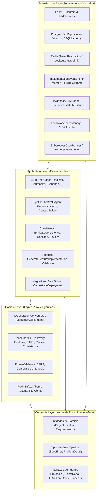
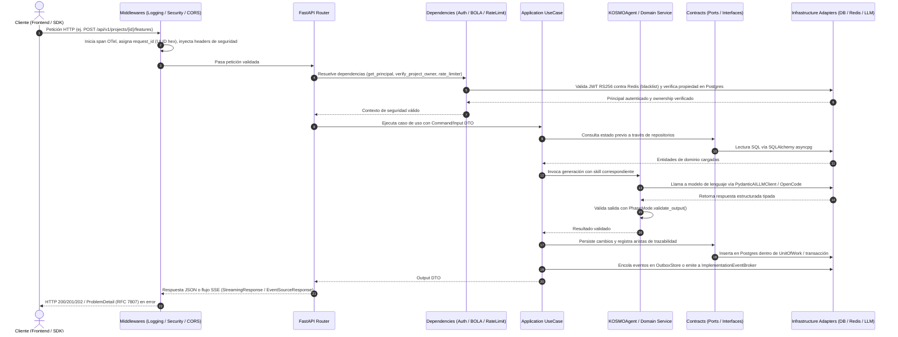
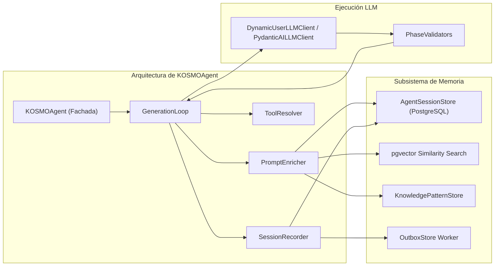
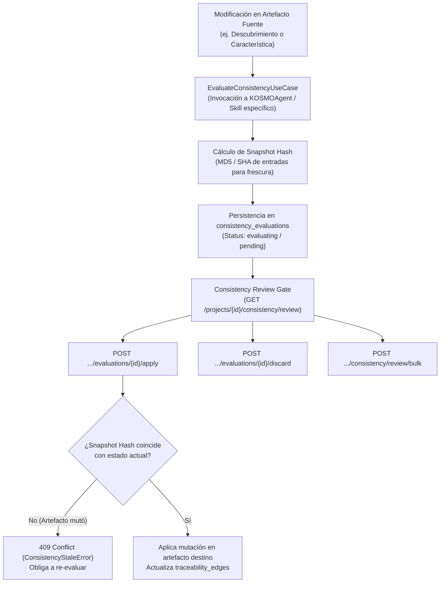
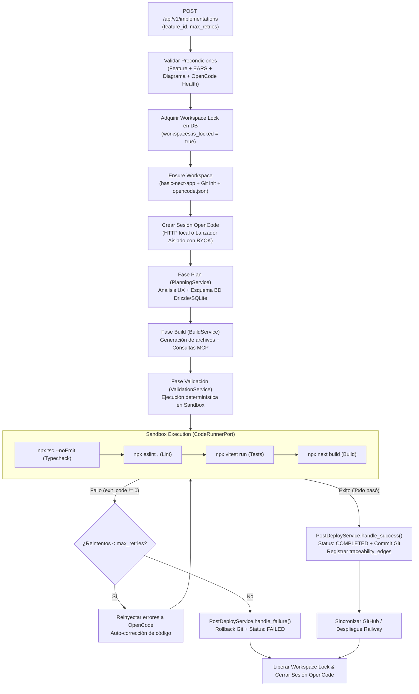
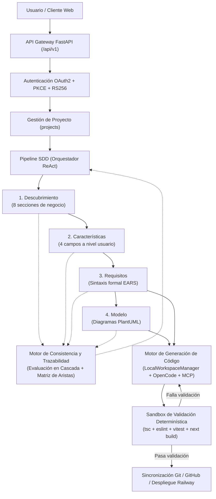

# KOSMO — Backend

Documentación técnica y guía de arquitectura del backend de KOSMO.

**Autor:** Gianfranco Pupiales  
**Fecha:** 29 de Septiembre de 2026

---

## 1. Descripción del backend

El backend de KOSMO es una API REST asíncrona construida sobre **FastAPI** y **Python 3.13**, diseñada para implementar una plataforma de **Spec-Driven Development (SDD)** asistida por inteligencia artificial.

Su responsabilidad técnica dentro de la plataforma abarca:
- **Gestión de identidad y seguridad:** Autenticación de usuarios bajo OAuth 2.0 con PKCE (RFC 7636), emisión y rotación estricta de tokens JWT RS256, rate limiting defensivo y cifrado simétrico (Fernet) para credenciales BYOK (Bring Your Own Key) e integraciones de terceros.
- **Pipeline SDD formal:** Orquestación secuencial y bidireccional del ciclo de especificación del software en cinco fases acopladas:
  1. *Descubrimiento:* Visión del producto y reglas de negocio estructuradas en 8 secciones canónicas.
  2. *Características:* Capacidades funcionales del sistema definidas en 4 campos estándar.
  3. *Requisitos:* Especificación formal no ambigua bajo sintaxis EARS (*Easy Approach to Requirements Syntax*) con criterios de aceptación Dado-Cuando-Entonces (*Given-When-Then*).
  4. *Modelo:* Diagramas de actividad UML generados en sintaxis PlantUML con particiones por rol y decisiones.
  5. *Implementación:* Generación de código ejecutable full-stack sobre Next.js (App Router, React 19, TypeScript, Vitest, Tailwind CSS, Drizzle ORM y SQLite/libsql).
- **Consistencia y trazabilidad continua:** Mantenimiento de una matriz de trazabilidad persistida (`traceability_edges`) que vincula requisitos con características y archivos fuente generados. Evaluación de impacto y propagación de inconsistencias en cascada (upstream y downstream) con guardrails de frescura mediante hashing de snapshots.
- **Generación de código y aislamiento de procesos:** Coordinación de sesiones de codificación con el motor **OpenCode**, aprovisionamiento y control de concurrencia sobre workspaces locales mediante locks en base de datos, ejecución de suites de validación determinística (`tsc`, `eslint`, `vitest`, `next build`) con auto-corrección de errores y streaming de eventos en tiempo real (SSE).
- **Integraciones externas:** Vinculación OAuth y sincronización con repositorios de GitHub y orquestación de despliegues en la nube en Railway.

---

## 2. Stack tecnológico

El stack refleja de forma estricta las dependencias y herramientas en producción y desarrollo del proyecto:

| Componente | Tecnología | Versión | Propósito en KOSMO |
|---|---|---|---|
| **Runtime** | Python | `>= 3.13` | Entorno de ejecución principal del backend |
| **Framework Web** | FastAPI | `>= 0.136.1` | Definición de routers, OpenAPI, inyección de dependencias y middlewares |
| **Servidor ASGI** | Uvicorn | `>= 0.46.0` | Servidor HTTP de alto rendimiento con soporte uvloop y workers configurables |
| **Base de datos principal** | PostgreSQL | `16+` | Persistencia relacional de proyectos, artefactos SDD, auditoría y sesiones |
| **Búsqueda vectorial** | pgvector | `>= 0.4.2` | Extensión de PostgreSQL para embeddings y similitud semántica de sesiones |
| **ORM / Acceso a datos** | SQLAlchemy | `>= 2.0.49` | Mapeo objeto-relacional asíncrono (`sqlalchemy[asyncio]`) y Unit of Work |
| **Driver de base de datos** | asyncpg | `>= 0.31.0` | Driver nativo asíncrono para PostgreSQL con bypass de cache para Supabase Pooler |
| **Caché y mensajería efímera** | Redis | `>= 7.4.0` | Lista de revocación de JWT (JTI), códigos PKCE con TTL, rate limiting y broker SSE |
| **Driver Redis** | redis-py (`[hiredis]`) | `>= 7.4.0` | Conexión asíncrona a Redis con parser en C de alto rendimiento |
| **Migraciones** | Alembic | `>= 1.18.4` | Versionado y aplicación de esquemas relacionales asíncronos |
| **Hashing de credenciales** | Argon2id (`argon2-cffi`) | `>= 25.1.0` | Hashing robusto de contraseñas de usuarios conforme a OWASP 2025 |
| **Criptografía simétrica** | Cryptography (Fernet) | `>= 46.0.7` | Cifrado simétrico AES-128-CBC + HMAC-SHA256 de API keys y tokens OAuth |
| **Tokens criptográficos** | python-jose (`[cryptography]`) | `>= 3.5.0` | Firma y validación asimétrica de JWT mediante algoritmo RS256 |
| **Identificadores universales** | python-ulid | `>= 3.1.0` | Generación de identificadores ordenables con prefijo de dominio (`IdGenerator`) |
| **Validación y esquemas** | Pydantic / Pydantic Settings | `>= 2.7 / >= 2.14` | Tipado de contratos, validación de payloads y carga de variables de entorno |
| **Framework de agentes LLM** | pydantic-ai | `>= 1.86.1` | Orquestación de llamadas tipadas a modelos de lenguaje con reintentos y streaming |
| **Embeddings locales** | fastembed | `>= 0.5` | Generación local de representaciones vectoriales sin consumo de API externa |
| **Streaming en tiempo real** | sse-starlette | `>= 2.0.0` | Transmisión de eventos Server-Sent Events (SSE) en chat y compilación |
| **Observabilidad** | structlog / Logfire | `>= 25.5 / >= 4.32` | Logs estructurados JSON, tracing OpenTelemetry y exportación a Logfire |
| **Métricas** | prometheus-fastapi-instrumentator | `>= 7.0.0` | Métricas operativas en endpoint `/metrics` |
| **Gestor de paquetes** | uv | `>= 0.11` | Instalación ultrarrápida de dependencias, bloqueo y ejecución de scripts |
| **Testing** | pytest / pytest-asyncio / pytest-cov | `>= 9.0 / >= 1.3 / >= 7.1` | Testing unitario con fakes tipados, integración y reporte de cobertura |
| **Tests de propiedades** | Hypothesis | `>= 6.152.1` | Pruebas basadas en propiedades sobre invariantes de dominio y conversores |
| **Tests de contrato** | Schemathesis | `>= 4.15.2` | Validación de cumplimiento estricto de la especificación OpenAPI |
| **Linters y tipado** | Ruff / Pyright / Import-Linter | `>= 0.15 / >= 1.1 / >= 2.11` | Linting, formateo, verificación de tipos en modo estricto y chequeo arquitectónico |

---

## 3. Arquitectura

KOSMO backend está diseñado estrictamente bajo el patrón de **Arquitectura Hexagonal (Ports & Adapters)** con cuatro capas concéntricas forzadas en tiempo de desarrollo y CI por la herramienta `.importlinter`:



### 3.1. Dirección y reglas de dependencia

1. **Flujo unidireccional:** Cada capa depende únicamente de las capas situadas a su derecha o interior:
   `infrastructure` → `application` → `domain` → `contracts`
2. **`contracts/` (Kernel):** Define los tipos de datos primarios, identificadores tipados, DTOs compartidos, contratos RFC 7807 y todas las interfaces de puerto (`typing.Protocol` o clases base abstractas). No depende de ninguna otra capa del proyecto ni de bibliotecas con I/O.
3. **`domain/` (Lógica Pura):** Aloja algoritmos determinísticos y reglas de negocio. Está libre de I/O, llamadas de red, accesos al reloj del sistema o generadores pseudoaleatorios directos.
4. **`application/` (Casos de Uso):** Orquesta los flujos de negocio invocando la lógica de dominio y consumiendo las interfaces de puerto definidas en `contracts/`. Los puertos se inyectan a través del constructor.
5. **`infrastructure/` (Adaptadores):** Implementa las interfaces de puerto utilizando tecnologías concretas (SQLAlchemy, Redis, HTTPX, OpenCode, Git). Expone la API HTTP mediante FastAPI y conecta los adaptadores en la raíz de composición.

### 3.2. Raíz de Composición (*Composition Root*)

Todo el cableado de dependencias se centraliza de manera explícita en el paquete:
```text
src/kosmo/infrastructure/api/composition/
├── __init__.py          # AppContainer y punto de entrada build_app_components()
├── auth.py              # Ensamblado de seguridad, JWT, Argon2id, Redis stores y casos de uso de auth
├── codegen.py           # Ensamblado de OpenCode client, workspace manager, code runner y event broker
├── integrations.py      # Ensamblado de clientes GitHub, Railway y workers de polling
├── pipeline.py          # Ensamblado de KOSMOAgent, LLM client dinámico, memoria y outbox
├── sdd.py               # Ensamblado de casos de uso de Discovery, Features, Requirements, Modelo y Consistency
└── skill_registration.py# Registro canónico de skills en el SkillRegistry
```

Durante el evento de `lifespan` en `main.py`, se invoca `build_app_components(settings)` generando un contenedor inmutable `AppContainer` que se adjunta a `app.state.container`. Los routers de FastAPI obtienen sus casos de uso únicamente a través de funciones factoría tipadas que consumen `request.app.state.container`.

---

## 4. Estructura de directorios

```text
backend/
├── alembic/                                    # Versionado y migraciones de PostgreSQL
│   ├── versions/                               # Scripts de migración individuales
│   └── env.py                                  # Configuración de ejecución asíncrona de Alembic
├── src/kosmo/                                  # Código fuente principal del backend
│   ├── contracts/                              # CAPA 1: Kernel, entidades, errores y puertos
│   │   ├── ai/                                 #   Contratos de chat, consistencia y configuración AI
│   │   ├── audit/                              #   AuditEvent y AuditEventSink
│   │   ├── auth/                               #   Principal, UserRepository, TokenStore, PasswordHasher
│   │   ├── integrations/                       #   Puertos para GitHub, Railway y Git
│   │   ├── llm/                                #   Protocolos LLMClient y Embedder
│   │   ├── memory/                             #   AgentMemoryPort y KnowledgePatternStore
│   │   ├── persistence/                        #   Puertos de persistencia general y OutboxPort
│   │   ├── pipeline/                           #   PhaseMode, AgentPort, Skill y Tool
│   │   ├── sdd/                                #   Entidades SDD, errores RFC 7807 e IDs tipados
│   │   └── telemetry.py                        #   Decorador @traced y utilitarios de telemetría
│   ├── domain/                                 # CAPA 2: Algoritmos puros y validaciones de negocio
│   │   ├── agent_memory/                       #   Fábrica de sesiones y cálculo de calidad
│   │   ├── auth/                               #   Verificación matemática de PKCE (RFC 7636)
│   │   ├── codegen/                            #   Seguridad de rutas, parseo de compilación y tokens UX
│   │   ├── pipeline/                           #   Modos de fase (PhaseModes), validadores y prompts
│   │   └── sdd/                                #   IdGenerator (ULID con prefijo) y conversores Markdown
│   ├── application/                            # CAPA 3: Casos de uso y orquestación
│   │   ├── ai/                                 #   Gestión de preferencias BYOK y validación de conexiones
│   │   ├── auth/                               #   Flujos Register, Authorize, Exchange, Refresh, Revoke
│   │   ├── chat/                               #   Procesamiento de mensajes, sesiones y modificaciones directas
│   │   ├── codegen/                            #   Generación de código, validación de workspaces y recuperación
│   │   ├── consistency/                        #   Evaluación de inconsistencias, cascada y revisiones
│   │   ├── discovery/                          #   Generación, consulta, refinamiento y guardado de visión
│   │   ├── features/                           #   Generación, sugerencia, edición manual y borrado
│   │   ├── integrations/                       #   Sincronización con GitHub y despliegue en la nube
│   │   ├── knowledge/                          #   Consolidación de patrones de conocimiento cross-project
│   │   ├── modelo/                             #   Generación y consulta de diagramas de actividad PlantUML
│   │   ├── pipeline/                           #   KOSMOAgent, GenerationLoop, ContextBuilder, SessionRecorder
│   │   ├── projects/                           #   CRUD y borrado en cascada de proyectos
│   │   ├── requirements/                       #   Generación EARS, refinamiento y regeneración
│   │   └── traceability/                       #   Navegación de edición y permisos por nivel SDD
│   ├── infrastructure/                         # CAPA 4: Adaptadores de infraestructura y frameworks
│   │   ├── api/                                #   Capa HTTP FastAPI
│   │   │   ├── composition/                    #     Composition Root y contenedor AppContainer
│   │   │   ├── dependencies/                   #     Inyectores Depends (auth, bola, rate-limiting)
│   │   │   ├── middlewares/                    #     Logging estructurado, SecurityHeaders, CORS
│   │   │   ├── routers/                        #     Endpoints REST y SSE agrupados por dominio
│   │   │   ├── implementation_broker.py        #     Broker SSE en memoria / Redis para eventos de codegen
│   │   │   ├── main.py                         #     Fábrica de FastAPI, lifespan, exception handlers
│   │   │   └── schemas.py                      #     DTOs Pydantic de entrada y salida HTTP
│   │   ├── codegen/                            #   Adaptador OpenCode HTTP/Isolated y templates Next.js
│   │   ├── git/                                #   Adaptador asíncrono para operaciones Git en workspace
│   │   ├── integrations/                       #   Clientes HTTP externos (GitHub, Railway) y polling worker
│   │   ├── llm/                                #   Adaptadores pydantic-ai, BYOK dinámico, embeddings
│   │   ├── persistence/                        #   Adaptadores PostgreSQL (SQLAlchemy) y Redis
│   │   │   ├── postgres/                       #     Modelos ORM, repositorios tipados, Outbox y UoW
│   │   │   └── redis/                          #     Almacenes de tokens, códigos PKCE y rate limits
│   │   ├── sandbox/                            #   Ejecutores de comandos seguros (local, docker, remoto)
│   │   ├── scripts/                            #   Scripts de mantenimiento (seed_dev_user.py)
│   │   ├── security/                           #   Argon2id, RS256 JWT codec, Fernet secret cipher
│   │   └── telemetry/                          #   Bootstrap de logging, métricas Prometheus y OpenTelemetry
│   └── config.py                               # Configuración tipada mediante Pydantic Settings
├── tests/                                      # Pruebas automatizadas
│   ├── unit/                                   #   Tests unitarios puros con repositorios fake en memoria
│   ├── integration/                            #   Tests con contenedores reales (Postgres, Redis)
│   ├── contract/                               #   Validación de contratos OpenAPI con Schemathesis
│   ├── properties/                             #   Tests de invariantes basados en propiedades (Hypothesis)
│   ├── golden/                                 #   Tests dorados canónicos de comportamiento
│   ├── conftest.py                             #   Fixtures compartidos y configuración de pytest
│   └── factories.py                            #   Builders sintéticos tipados para pruebas
├── .env.example                                # Plantilla de configuración de entorno
├── .importlinter                               # Reglas arquitectónicas de importación
├── alembic.ini                                 # Configuración del motor de migraciones
├── pyproject.toml                              # Dependencias y configuración de herramientas
└── uv.lock                                     # Archivo de bloqueo determinista de dependencias
```

---

## 5. Flujo general de funcionamiento

El procesamiento de una petición HTTP en KOSMO sigue una secuencia controlada que garantiza seguridad perimetral, aislamiento entre inquilinos y separación estricta de responsabilidades:



1. **Entrada y Middlewares:** La petición es interceptada por `RequestLoggingMiddleware` (genera un `request_id` único con `ULID().hex`, propaga variables de contexto y mide latencias) y `SecurityHeadersMiddleware` (inyecta `nosniff`, `DENY` en frame-options, HSTS y CSP defensiva).
2. **Control de Acceso Perimetral (BOLA / IDOR Protection):** Los inyectores en `dependencies/auth.py` (`verify_project_owner`, `verify_feature_owner`) verifican que la entidad solicitada pertenezca al usuario autenticado. **Si no pertenece o no existe, responden uniformemente con `404 Not Found`** para evitar la enumeración o fuga de existencia de recursos ajenos.
3. **Limitación de Velocidad:** `IpRateLimiter` ejecuta un script atómico Lua sobre Redis (`INCR` + `EXPIRE`). Los endpoints de generación de IA aplican `ProjectGenerationRateLimiter` para controlar el número de ejecuciones concurrentes y horarias por proyecto.
4. **Dominio y Algoritmos:** El caso de uso orquesta la ejecución delegando las transformaciones en algoritmos puros de `domain/`.
5. **Persistencia e Infraestructura:** Los adaptadores escriben en PostgreSQL mediante sesiones asíncronas aisladas (`AsyncSession`) administradas por `SqlAlchemyUnitOfWork`.
6. **Respuesta:** Respuestas exitosas se devuelven en `application/json; charset=utf-8` o `text/event-stream`. Errores generan un `JSONResponse` estructurado bajo RFC 7807 (`application/problem+json`).

---

## 6. Agentes e IA

El subsistema de inteligencia artificial de KOSMO está implementado en `src/kosmo/application/pipeline/` y `src/kosmo/domain/pipeline/`. No es un wrapper monolítico, sino una máquina de estados orquestada por componentes con responsabilidades especializadas:



### 6.1. Componentes del agente

- **`KOSMOAgent` (`application/pipeline/kosmo_agent.py`):** Fachada que orquesta el ciclo de generación y chat. Provee tres métodos principales:
  - `execute_with_skill()`: Ejecución de un skill de pipeline con enriquecimiento, consulta de herramientas y bucle de validación.
  - `execute_conversation()` / `execute_conversation_stream()`: Manejo del diálogo interactivo en fases de chat.
  - `execute_direct_modification()`: Aplicación inmediata de instrucciones sobre documentos sin fase de planificación previa.
- **`PromptEnricher` (`application/pipeline/prompt_enricher.py`):** Construye el contexto del prompt del sistema en tres niveles:
  1. *Contexto del proyecto:* Agrega el resumen de sesiones previas en otras fases del mismo proyecto.
  2. *Similitud semántica cross-project:* Genera el embedding de la solicitud del usuario mediante `fastembed` o `openai` y realiza una búsqueda de vecinos más cercanos en PostgreSQL (`pgvector`) sobre sesiones de otros proyectos que hayan resultado válidas.
  3. *Patrones de conocimiento:* Inyecta reglas consolidadas de la fase (`KnowledgePatternModel`).
- **`ToolResolver` (`application/pipeline/tool_resolver.py`):** Pre-consulta el `KnowledgeToolRegistry` antes de generar. Entre las herramientas disponibles registradas en `src/kosmo/infrastructure/llm/knowledge_tools.py` se encuentran:
  - `get_phase_document`: Obtiene el contenido de un documento de fase previa.
  - `get_downstream_artifacts`: Lista artefactos derivados downstream.
  - `get_requirements_for_feature`: Recupera requisitos EARS asociados a una característica.
  - `get_diagram_for_feature`: Recupera la sintaxis PlantUML de una característica.
  - `get_impact`: Consulta aristas de trazabilidad para predecir impacto de modificaciones.
- **`GenerationLoop` (`application/pipeline/generation_loop.py`):** Bucle de ejecución que llama al LLM mediante `complete_typed()`, valida la respuesta contra `mode.validate_output()`, y en caso de detectar errores, reinyecta el feedback en el prompt iterando hasta alcanzar la validez o agotar el límite de iteraciones (por defecto 8).
- **`SessionRecorder` (`application/pipeline/session_recorder.py`):** Persiste la sesión completa (`AgentSessionModel`) con logs de razonamiento, respuestas y métricas. Inserta un registro en `outbox_jobs` con el trabajo `reflect_and_consolidate`.

### 6.2. Registro de Skills (`SkillRegistry`)

El registro `SkillRegistry` mapea nombres canónicos con instancias de `PhaseMode`:
- `discovery_generate` y `discovery_refine`: Generación y refinamiento del documento de visión (8 secciones).
- `features_generate`: Extracción de características funcionales a nivel de usuario (4 campos: código, título, descripción, origen).
- `ears_generate` y `requirements_refine`: Generación y ajuste de requisitos bajo sintaxis EARS formal y criterios de aceptación.
- `modelo_generate`: Generación del diagrama de actividad UML en sintaxis PlantUML.
- `discovery_chat`, `features_chat`, `requirements_chat`: Diálogo conversacional especializado por nivel de abstracción.
- `consistency_evaluate` (y sus variantes upstream/downstream entre cada par de fases): Evaluación de consistencia e impacto cruzado.
- `consistency_correct`: Generación de texto de reemplazo para resolver inconsistencias.
- `direct_modification`: Edición directa sobre secciones de documentos a partir de lenguaje natural.

### 6.3. Proveedores y Soporte BYOK (*Bring Your Own Key*)

El backend implementa un adaptador dinámico `DynamicUserLLMClient` que permite a cada usuario utilizar sus propias credenciales de IA:
- **Proveedores soportados:** DeepSeek, OpenAI, Anthropic, Google Gemini y Noop (mock para testing/desarrollo local).
- **Gestión de claves:** Las API keys se almacenan cifradas en la tabla `user_ai_configs` con Fernet (`AES-128-CBC`). En cada solicitud, el cliente resuelve la clave del usuario autenticado o recurre a las variables de entorno del sistema (`LLM_PROVIDER`, `LLM_MODEL`, `LLM_API_KEY`).
- **Caché en memoria:** Las configuraciones se cachean con TTL configurable (`USER_AI_CONFIG_CACHE_TTL_SECONDS`, por defecto 60s) con invalidación inmediata al actualizar preferencias en `/api/v1/ai-config`.

---

## 7. Chat y sesiones

El sistema de chat permite iterar interactivamente sobre los artefactos de cada fase manteniendo el contexto de conversación y la coherencia del modelo:

### 7.1. Modelo y ciclo de vida de sesiones

- **Sesión de chat (`chat_sessions`):** Identificada por un `ChatSessionId` (ULID). Agrupa mensajes por `project_id`, `phase` (`discovery`, `features`, `requirements`, `model`) y opcionalmente `context_id` (para asociar el chat a una característica específica en las fases de características o requisitos).
- **Mensajes (`chat_messages`):** Identificados por `ChatMessageId` (ULID). Registran el rol (`user`, `assistant`, `system`), contenido en texto y un payload JSON opcional `suggested_change` con el diff propuesto (`diff_before`, `diff_after`, `section`, `rationale`).
- **Creación y recuperación:**
  - `POST /api/v1/projects/{project_id}/chat-sessions`: Crea un nuevo hilo de conversación.
  - `GET /api/v1/projects/{project_id}/chat-sessions`: Lista los hilos de una fase con contador de mensajes y fecha del último mensaje.
  - `DELETE /api/v1/projects/{project_id}/chat-sessions/{session_id}`: Elimina la sesión y todos sus mensajes asociados en cascada.

### 7.2. Procesamiento de mensajes y mitigación de inyecciones

Cuando se envía un mensaje (`POST /chat` o `POST /chat/stream`):
1. **Validación de fase (`ValidatePhaseContextUseCase`):** Comprueba si el mensaje corresponde al nivel semántico de la fase activa. Si un usuario solicita detalles técnicos de código en la fase de descubrimiento, el sistema responde con una redirección semántica (`ChatResponse.from_redirect`) impidiendo la contaminación cruzada.
2. **Sanitización y control de tokens:**
   - Se utiliza una ventana máxima de 20 mensajes recientes y un presupuesto estricto de **6000 tokens estimados**. Si el historial excede el presupuesto, se descartan los mensajes antiguos preservando intactas las decisiones de cambio previas.
   - Todo mensaje de usuario se encapsula dentro de etiquetas delimitadoras `<user_message>` para neutralizar ataques de inyección de prompt (*jailbreak / role override*).
3. **Modificación directa vs. Sugerencias:**
   - En el chat convencional, el agente sugiere cambios en `suggested_changes`.
   - En modificación directa (`/api/v1/documents/modify-direct`), el caso de uso `ProcessChatModificationUseCase` aplica la alteración directamente sobre la sección afectada del documento, persistiendo la nueva versión en `document_versions` y habilitando su reversión posterior en `/api/v1/documents/revert`.

---

## 8. Consistencia y trazabilidad

KOSMO aplica una disciplina estricta de coherencia donde las modificaciones en una fase repercuten y se auditan a lo largo de toda la cadena de especificación:

> **Descubrimiento** → **Características** → **Requisitos (EARS)** → **Modelo (PlantUML)** → **Implementación (Código)**



### 8.1. Evaluación en Cascada

- **Cascada descendente (*Downstream*):** Un cambio en Descubrimiento evalúa impacto sobre Características, Requisitos, Diagramas e Implementaciones. Un cambio en una Característica evalúa sus Requisitos asociados y Diagramas.
- **Verificación ascendente (*Upstream*):** En creación o edición manual (`POST /manual`, `PUT /manual`), el sistema verifica que la característica no contradiga flagrantemente el documento de descubrimiento. Si contradice la visión, la edición es rechazada con `409 Conflict`.
- **Streaming de evaluación:** `POST /api/v1/projects/{project_id}/consistency/evaluate/stream` ejecuta la cascada completa emitiendo progreso por SSE (`stage_start`, `phase_progress`, `impact_detected`, `complete`).

### 8.2. Freshness Guardrail y Gestión de Evaluaciones

- **Persistencia de evaluaciones (`consistency_evaluations`):** Cada inconsistencia detectada se registra con `source_phase`, `target_phase`, `target_artifact_id`, diff propuesto y un `snapshot_hash`.
- **Prevención de colisiones obsoletas:** Si un artefacto cambia mientras una sugerencia de consistencia estaba pendiente, al llamar a `/apply` el sistema detecta que el `snapshot_hash` no coincide con el estado actual y responde `409 Conflict` (`ConsistencyStaleError`), evitando aplicar parches desactualizados.
- **Resolución en lote y actividad:**
  - `GET /api/v1/projects/{project_id}/consistency/status`: Retorna contadores de sugerencias no resueltas para badges de interfaz.
  - `POST /api/v1/projects/{project_id}/consistency/review/bulk`: Permite aplicar o descartar todas las sugerencias de una fase en una sola transacción.
  - `GET /api/v1/projects/{project_id}/consistency/activity`: Feed cronológico de acciones de consistencia aplicadas y descartadas.

---

## 9. Generación de código

El ciclo de generación de código traduce la especificación formal (Requisitos EARS + Diagrama de Actividad UML) en una aplicación full-stack Next.js ejecutable:



### 9.1. Fases del pipeline de generación

1. **Precondiciones:** Valida la existencia de la característica, presencia obligatoria de requisitos EARS (`MissingRequirementsError`), diagrama de actividad generado (`MissingDiagramError`) y disponibilidad del servicio OpenCode (`OpenCodeUnavailableError`).
2. **Workspace Lock:** Se bloquea el registro en `workspaces` mediante `acquire_lock(project_id)`. Si hay otra generación en curso, se rechaza la operación concurrente para evitar corrupción de archivos.
3. **Aprovisionamiento del espacio de trabajo (`LocalWorkspaceManager`):**
   - Directorio raíz configurado en `KOSMO_WORKSPACES_DIR`.
   - Inicializa el repositorio Git (`git_init_async`) a partir de la plantilla `basic-next-app` (Next.js App Router, React 19, Tailwind CSS, Vitest, TypeScript, Drizzle ORM sobre SQLite/libsql).
   - Genera el archivo `AGENTS.md` y registra las skills de desarrollo (`kosmo-implementation`, `kosmo-testing`, `kosmo-drizzle`, `kosmo-nextjs`, `kosmo-ui`).
   - Genera `opencode.json` con servidores MCP preconfigurados:
     - `kosmo-context`: Conexión remota a `KOSMO_MCP_BASE_URL` (`/mcp`) inyectando `KOSMO_PROJECT_ID`.
     - `token-savior`: Herramienta local para optimización de contexto y tokens.
     - `context7`: Documentación oficial de librerías.
4. **Planificación (`PlanningService`):** Analiza el contexto de UX a partir del descubrimiento (`UXAnalyzerUseCase`), inspecciona el esquema de base de datos actual (`schema.ts` de Drizzle) y elabora el plan de implementación.
5. **Construcción (`BuildService`):** Envía las instrucciones a OpenCode. El agente de OpenCode lee los archivos necesarios, utiliza las herramientas MCP para obtener requisitos y diagramas, y escribe el código fuente en el workspace.
6. **Validación Determinística (`ValidationService`):**
   - Ejecuta cuatro etapas mediante `CodeRunnerPort` (`SubprocessCodeRunner`, `EphemeralDockerCodeRunner` o `RemoteCodeRunner`):
     1. `npx tsc --noEmit` (Verificación estricta de tipos)
     2. `npx eslint .` (Análisis estático de código)
     3. `npx vitest run` (Ejecución de pruebas unitarias y de integración)
     4. `npx next build` (Compilación de producción)
   - Si una etapa falla, el error se captura y se reenvía a OpenCode para auto-corrección hasta `max_retries` veces (por defecto 3).
7. **Finalización y Trazabilidad (`PostDeployService`):**
   - *En éxito:* Se marca la implementación como `COMPLETED`, se realiza commit en Git con el hash resultante, se registran las relaciones en `traceability_edges` (vinculando la característica con cada archivo `.ts`/`.tsx` generado), y se emite el evento final `DONE`. Si el proyecto tiene GitHub vinculado, se realiza push opcional.
   - *En fallo:* Se marca como `FAILED`, se ejecuta rollback en Git al commit anterior (`git_rollback_async`) para dejar el workspace en estado limpio y funcional, y se emite el evento `ERROR`.
   - *Cierre garantizado:* En el bloque `finally` se cierra la sesión en OpenCode y se libera el lock del workspace.

### 9.2. Recuperación de implementaciones zombies

En caso de que el backend sufra un reinicio forzado durante una generación activa:
- La función `recover_zombie_implementations` se ejecuta al arrancar el lifespan de FastAPI y de manera periódica en segundo plano cada 100 segundos.
- Localiza todas las implementaciones en estado `IN_PROGRESS`, cierra las sesiones huérfanas en OpenCode, libera los locks de workspace y actualiza su estado a `FAILED`.

---

## 10. Comunicación en tiempo real (Server-Sent Events)

El backend de KOSMO utiliza **Server-Sent Events (SSE)** mediante `sse-starlette` y `StreamingResponse` de Starlette para operaciones de larga duración:

| Endpoint | Formato de eventos | Contenido del stream |
|---|---|---|
| `GET /api/v1/implementations/{id}/events` | `event: <tipo>\ndata: <json>\n\n` | Progreso de compilación: `session_created`, `plan_progress`, `step_progress`, `validation_start`, `validation_result`, `done`, `error` |
| `POST /api/v1/projects/{id}/discovery/chat/stream` | `data: {"type": "token" / "message", ...}\n\n` | Streaming de tokens del modelo en tiempo real y payload final del mensaje con diff |
| `POST /api/v1/features/{id}/chat/stream` | `data: {"type": "token" / "message", ...}\n\n` | Streaming de tokens y cambios sugeridos en características |
| `POST /api/v1/features/{id}/requirements/chat/stream` | `data: {"type": "token" / "message", ...}\n\n` | Streaming de tokens y cambios sugeridos en requisitos EARS |
| `POST /api/v1/projects/{id}/consistency/evaluate/stream` | `event: <stage>\ndata: <json>\n\n` | Evaluación de consistencia en cascada entre fases SDD |

### 10.1. Broker de Eventos (`ImplementationEventBroker`)

La distribución de eventos SSE en la generación de código está desacoplada mediante `ImplementationEventBroker` (`src/kosmo/infrastructure/api/implementation_broker.py`):
- **Modo en memoria (Worker único):** Utiliza `asyncio.Queue` por cada suscriptor y almacena un buffer histórico en memoria.
- **Modo distribuido (Múltiples workers / Redis):** Cuando `REDIS_URL` está configurado y el servidor opera con múltiples workers (`WORKERS > 1`), el broker serializa los eventos hacia **Redis Streams**, permitiendo que un cliente conectado a cualquier worker reciba el flujo completo de eventos sin importar en cuál worker se ejecute la tarea de generación.
- **Historial y reconexión:** Mantiene un historial de eventos por implementación con TTL (por defecto 1800 segundos / 30 minutos), permitiendo que la interfaz reconecte y reproduzca los eventos previos sin perder el estado de la compilación.

---

## 11. Base de datos

### 11.1. Configuración de PostgreSQL y SQLAlchemy

- **Versión de motor:** PostgreSQL 16+ con extensión `pgvector` activada.
- **Conexión asíncrona:** SQLAlchemy 2.0 AsyncIO con motor `create_async_engine` y driver `asyncpg`.
- **Compatibilidad con Supabase / PgBouncer:** La función `normalize_postgres_url` en `config.py` detecta URLs de poolers de Supabase (puerto 6543 o subdominio `pooler.supabase.com`) y desactiva automáticamente el cache de sentencias preparadas (`prepared_statement_cache_size=0`) para evitar errores de protocolo en modo transaction.
- **Dimensionamiento del pool:** Calculado en `build_app_components` dividiendo `db_pool_size` (default 60) y `db_max_overflow` (default 40) entre el número de workers activos (`server_workers`), garantizando `pool_pre_ping=True` y reciclaje de conexiones (`db_pool_recycle=1800s`).

### 11.2. Tablas y modelos del sistema

Persistencia estructurada en 22 modelos ORM declarados en `src/kosmo/infrastructure/persistence/postgres/models.py`:

| Tabla | Modelo | Clave Primaria | Responsabilidad |
|---|---|---|---|
| `users` | `UserModel` | `id` (String 64, ULID) | Cuentas de usuario, email (CITEXT único), nombre, password hasheado con Argon2id |
| `audit_log` | `AuditEventModel` | `id` (String 64, ULID) | Registro inmutable de eventos de auditoría y seguridad con metadata JSONB |
| `projects` | `ProjectModel` | `id` (String 64, ULID) | Proyectos creados por usuarios, nombre, slug único y fase activa |
| `features` | `FeatureModel` | `id` (String 64, ULID) | Características del sistema (UQ: `project_id`, `number`) |
| `requirements` | `RequirementModel` | `feature_id` (FK a features) | Especificación en Markdown de requisitos EARS por característica |
| `traceability_edges` | `TraceabilityEdgeModel` | `id` (String 64, ULID) | Grafo de trazabilidad entre artefactos (`source_type`, `target_type`, IDs) |
| `discovery` | `DiscoveryDocumentModel` | `project_id` (FK a projects) | Documento de visión y reglas de negocio del proyecto en Markdown |
| `agent_sessions` | `AgentSessionModel` | `id` (String 64, ULID) | Historial de ejecuciones del agente, logs de razonamiento, métricas y embedding vectorial (`Vector`) |
| `activity_diagrams` | `ActivityDiagramModel` | `id` (String 64, ULID) | Diagramas de actividad PlantUML por característica (`feature_id` único) |
| `knowledge_patterns` | `KnowledgePatternModel` | `id` (String 64, ULID) | Patrones de conocimiento y reglas consolidadas por fase |
| `chat_sessions` | `ChatSessionModel` | `id` (String 64, ULID) | Hilos de conversación organizados por proyecto, fase y contexto |
| `chat_messages` | `ChatMessageModel` | `id` (String 64, ULID) | Mensajes individuales con rol, contenido y diffs de cambio sugeridos |
| `document_versions` | `DocumentVersionModel` | `id` (String 64, ULID) | Snapshot histórico de versiones de documentos para reversión (`revert`) |
| `outbox_jobs` | `OutboxJobModel` | `id` (String 64, ULID) | Cola persistente de trabajos asíncronos en segundo plano (patrón Transactional Outbox) |
| `consistency_evaluations` | `ConsistencyEvaluationModel` | `id` (String 64, ULID) | Evaluaciones de consistencia con hash de snapshot, diffs y estado de resolución |
| `user_preferences` | `UserPreferenceModel` | `id` (String 64, ULID) | Reglas de estilo y preferencias del usuario inyectadas en prompts |
| `workspaces` | `WorkspaceModel` | `id` (String 64, ULID) | Registro de directorios de workspace, rama Git activa y estado de lock concurrente |
| `feature_implementations` | `FeatureImplementationModel` | `id` (String 64, ULID) | Estado de compilación de código (`pending`, `in_progress`, `completed`, `failed`), intentos y archivos |
| `user_ai_configs` | `UserAiConfigModel` | `id` (String 64, ULID) | Configuración BYOK de IA por usuario con API key cifrada con Fernet |
| `user_integrations` | `UserIntegrationModel` | `id` (String 64, ULID) | Credenciales OAuth de usuarios para proveedores externos (GitHub, Railway) cifradas con Fernet |
| `project_integrations` | `ProjectIntegrationModel` | `id` (String 64, ULID) | Vinculación del proyecto con repositorios GitHub remotos y servicios de Railway |
| `code_sync_logs` | `CodeSyncLogModel` | `id` (String 64, ULID) | Historial de sincronizaciones y commits enviados a GitHub |

### 11.3. Migraciones con Alembic

Las migraciones residen en `backend/alembic/versions/`. Cada cambio estructural se versiona secuencialmente:
```bash
# Aplicar todas las migraciones pendientes
uv run alembic upgrade head

# Crear una nueva revisión
uv run alembic revision -m "descripcion_del_cambio"
```

---

## 12. API

La API REST expone 20 routers bajo el prefijo canónico `/api/v1` y `/mcp`:

### 12.1. Catálogo de Endpoints

| Router | Método | Ruta | Auth | Descripción |
|---|---|---|---|---|
| **Auth** | `POST` | `/api/v1/auth/register` | No | Registro de cuenta con hashing Argon2id |
| | `POST` | `/api/v1/auth/authorize` | No | Validación de credenciales + PKCE, emite `authorization_code` |
| | `POST` | `/api/v1/auth/token` | No | Intercambio de código + verifier por par JWT RS256 |
| | `POST` | `/api/v1/auth/refresh` | Sí (Refresh) | Rotación estricta de par de tokens (invalida el anterior) |
| | `GET` | `/api/v1/auth/me` | Bearer | Consulta de identidad y scopes del usuario autenticado |
| | `POST` | `/api/v1/auth/logout` | Bearer | Revocación explícita de sesión y blacklist de JTI |
| **AI Config (BYOK)** | `GET` | `/api/v1/ai-config/providers` | Bearer | Catálogo de proveedores y modelos disponibles |
| | `GET` | `/api/v1/ai-config` | Bearer | Obtiene la configuración de IA activa del usuario |
| | `POST` | `/api/v1/ai-config` | Bearer | Guarda o actualiza credenciales BYOK cifradas |
| | `POST` | `/api/v1/ai-config/test` | Bearer | Verifica conectividad con el proveedor de IA |
| | `DELETE` | `/api/v1/ai-config` | Bearer | Restablece las preferencias a los valores por defecto del sistema |
| **Projects** | `POST` | `/api/v1/projects` | Bearer | Crea un nuevo proyecto con slug único |
| | `GET` | `/api/v1/projects` | Bearer | Lista los proyectos del usuario autenticado |
| | `GET` | `/api/v1/projects/{project_id}` | Bearer | Obtiene el detalle de un proyecto por ID |
| | `DELETE` | `/api/v1/projects/{project_id}` | Bearer | Eliminación en cascada de proyecto, artefactos, workspaces y despliegues |
| **Discovery** | `POST` | `/api/v1/projects/{project_id}/discovery` | Bearer | Genera documento de descubrimiento con IA |
| | `GET` | `/api/v1/projects/{project_id}/discovery` | Bearer | Consulta el documento de descubrimiento actual |
| | `PUT` | `/api/v1/projects/{project_id}/discovery` | Bearer | Guarda o reemplaza manualmente el documento en Markdown |
| | `POST` | `/api/v1/projects/{project_id}/discovery/refine` | Bearer | Refina el documento aplicando instrucciones del usuario |
| | `POST` | `/api/v1/projects/{project_id}/discovery/chat` | Bearer | Mensaje interactivo en chat de descubrimiento |
| | `GET` | `/api/v1/projects/{project_id}/discovery/chat` | Bearer | Historial de chat de la fase de descubrimiento |
| | `POST` | `/api/v1/projects/{project_id}/discovery/chat/stream` | Bearer | Streaming SSE de mensajes de chat de descubrimiento |
| **Features** | `POST` | `/api/v1/projects/{project_id}/features` | Bearer | Genera características a partir del descubrimiento con IA |
| | `GET` | `/api/v1/projects/{project_id}/features` | Bearer | Lista características asociadas al proyecto |
| | `POST` | `/api/v1/projects/{project_id}/features/suggest` | Bearer | Sugiere 3 características adicionales no duplicadas |
| | `POST` | `/api/v1/projects/{project_id}/features/manual` | Bearer | Crea característica manualmente con validación upstream |
| | `PUT` | `/api/v1/projects/{project_id}/features/{feature_id}/manual` | Bearer | Edita manualmente una característica existente |
| | `POST` | `/api/v1/projects/{project_id}/features/save` | Bearer | Guarda lote de características seleccionadas |
| | `DELETE` | `/api/v1/projects/{project_id}/features/{feature_id}` | Bearer | Elimina característica y ejecuta borrado de código en segundo plano |
| | `POST` | `/api/v1/projects/{project_id}/features/{feature_id}/consistency/check` | Bearer | Pre-verificación de consistencia antes de guardar |
| **Feature Chat** | `POST` | `/api/v1/features/{feature_id}/chat` | Bearer | Mensaje de chat sobre una característica específica |
| | `GET` | `/api/v1/features/{feature_id}/chat` | Bearer | Historial de chat de la característica |
| | `POST` | `/api/v1/features/{feature_id}/chat/stream` | Bearer | Streaming SSE de chat sobre la característica |
| **Requirements** | `POST` | `/api/v1/features/{feature_id}/requirements/generate` | Bearer | Genera requisitos formales EARS con IA |
| | `GET` | `/api/v1/features/{feature_id}/requirements` | Bearer | Obtiene requisitos EARS en Markdown |
| | `PUT` | `/api/v1/features/{feature_id}/requirements` | Bearer | Guarda o actualiza requisitos en Markdown |
| | `DELETE` | `/api/v1/features/{feature_id}/requirements` | Bearer | Elimina los requisitos EARS de una característica |
| | `POST` | `/api/v1/features/{feature_id}/requirements/refine` | Bearer | Refina requisitos EARS mediante instrucciones textuales |
| | `POST` | `/api/v1/features/{feature_id}/requirements/regenerate` | Bearer | Regenera requisitos a partir del estado de la característica |
| **Requirement Chat** | `POST` | `/api/v1/features/{feature_id}/requirements/chat` | Bearer | Mensaje de chat sobre los requisitos de la característica |
| | `GET` | `/api/v1/features/{feature_id}/requirements/chat` | Bearer | Historial de chat de requisitos |
| | `POST` | `/api/v1/features/{feature_id}/requirements/chat/stream` | Bearer | Streaming SSE de chat de requisitos |
| **Chat Sessions** | `GET` | `/api/v1/projects/{project_id}/chat-sessions` | Bearer | Lista hilos de conversación por fase y contexto |
| | `POST` | `/api/v1/projects/{project_id}/chat-sessions` | Bearer | Crea un nuevo hilo de chat |
| | `DELETE` | `/api/v1/projects/{project_id}/chat-sessions/{session_id}` | Bearer | Elimina un hilo de chat y sus mensajes asociados |
| **Modelo (Diagrams)** | `POST` | `/api/v1/features/{feature_id}/diagram/generate` | Bearer | Genera diagrama de actividad PlantUML desde requisitos |
| | `POST` | `/api/v1/features/{feature_id}/diagram/propagate` | Bearer | Regenera diagrama tras cambios upstream |
| | `GET` | `/api/v1/features/{feature_id}/diagram` | Bearer | Obtiene sintaxis PlantUML del diagrama de actividad |
| | `DELETE` | `/api/v1/features/{feature_id}/diagram` | Bearer | Elimina el diagrama de actividad de la característica |
| **Consistency** | `GET` | `/api/v1/projects/{project_id}/consistency/status` | Bearer | Consulta resumen de inconsistencias pendientes por fase |
| | `GET` | `/api/v1/projects/{project_id}/consistency/review` | Bearer | Tarjetas de revisión por fase destino (Review Gate) |
| | `POST` | `/api/v1/projects/{project_id}/consistency/evaluations/{id}/apply` | Bearer | Aplica sugerencia con guardrail de frescura |
| | `POST` | `/api/v1/projects/{project_id}/consistency/evaluations/{id}/discard` | Bearer | Descarta sugerencia para el snapshot actual |
| | `POST` | `/api/v1/projects/{project_id}/consistency/review/bulk` | Bearer | Aplica o descarta en lote sugerencias de una fase |
| | `GET` | `/api/v1/projects/{project_id}/consistency/activity` | Bearer | Feed de auditoría de actividad de consistencia |
| | `POST` | `/api/v1/projects/{project_id}/consistency/evaluate/stream` | Bearer | Evaluación en cascada con streaming SSE |
| | `POST` | `/api/v1/projects/{project_id}/consistency/evaluate` | Bearer | Evaluación directa de consistencia e impacto |
| | `POST` | `/api/v1/projects/{project_id}/consistency/apply` | Bearer | Aplicación directa de impactos de consistencia |
| **Implementations** | `POST` | `/api/v1/implementations` | Bearer | Inicia compilación y generación de código (202 Accepted) |
| | `GET` | `/api/v1/implementations` | Bearer | Obtiene registro persistido y métricas de implementación |
| | `GET` | `/api/v1/implementations/{id}/events` | Bearer | Streaming SSE de eventos de compilación en tiempo real |
| | `GET` | `/api/v1/implementations/{id}/files/content` | Bearer | Lectura segura del contenido de un archivo del workspace |
| | `POST` | `/api/v1/implementations/{id}/validate` | Bearer | Ejecuta el pipeline determinístico (`tsc`, `eslint`, `vitest`, `build`) |
| **Documents** | `POST` | `/api/v1/documents/modify-direct` | Bearer | Modifica sección de documento directamente sin fase de plan |
| | `POST` | `/api/v1/documents/revert` | Bearer | Revierte documento a una versión histórica previa |
| **Traceability** | `GET` | `/api/v1/projects/{id}/traceability/{entity_id}/navigation` | Bearer | Verifica permisos de navegación y edición canónica SDD |
| | `GET` | `/api/v1/traceability/{entity_id}/navigation` | Bearer | Ruta legacy (emite cabecera `Deprecation: true`) |
| **Integrations** | `POST` | `/api/v1/integrations/{provider}/connect` | Bearer | Vincula cuenta OAuth de plataforma externa (GitHub, Railway) |
| | `GET` | `/api/v1/integrations/{provider}/status` | Bearer | Consulta estado de vinculación de la plataforma externa |
| | `DELETE` | `/api/v1/integrations/{provider}` | Bearer | Desvincula y revoca credenciales OAuth almacenadas |
| **GitHub** | `GET` | `/api/v1/projects/{project_id}/github` | Bearer | Consulta estado del repositorio remoto asociado al proyecto |
| | `POST` | `/api/v1/projects/{project_id}/github/push` | Bearer | Orquesta validación efímera y envío de commits a GitHub |
| **Deployment** | `GET` | `/api/v1/projects/{project_id}/deploy` | Bearer | Consulta estado de publicación en la nube y URLs de Railway |
| | `POST` | `/api/v1/projects/{project_id}/deploy` | Bearer | Inicia despliegue en la nube en Railway |
| | `DELETE` | `/api/v1/projects/{project_id}/deploy` | Bearer | Elimina el servicio publicado en Railway |
| **MCP Tools** | `POST` | `/mcp/tools/get_requirements` | Bearer | Endpoint MCP para consulta de requisitos por OpenCode |
| | `POST` | `/mcp/tools/get_activity_diagram` | Bearer | Endpoint MCP para consulta de diagramas por OpenCode |
| **Knowledge** | `POST` | `/api/v1/knowledge/consolidate` | Bearer (admin)| Fuerza consolidación manual de patrones de conocimiento |
| **Schemas** | `GET` | `/api/v1/schemas` | Bearer | Lista los nombres de esquemas DTO registrados |
| | `GET` | `/api/v1/schemas/{name}` | Bearer | Retorna JSON Schema OpenAPI de un DTO específico |
| **Health** | `GET` | `/health` | No | Verificación básica de operatividad del proceso |

### 12.2. Convenciones de API y formato de errores (RFC 7807)

- **Content-Type:** `application/json; charset=utf-8` en peticiones y respuestas exitosas.
- **Formato de errores:** `application/problem+json` conforme a RFC 7807:
```json
{
  "type": "urn:kosmo:features:not-found",
  "title": "Feature no encontrada",
  "status": 404,
  "detail": "La feature feat_01J... no existe en este proyecto",
  "instance": "/api/v1/projects/prj_01J.../features",
  "trace_id": "01J...",
  "violations": []
}
```
- **Identificadores:** Generados exclusivamente con `python-ulid` (`IdGenerator.generate("prefijo")`). Prefijos canónicos: `prj_` (proyecto), `feat_` (característica), `req_` (requisito), `usr_` (usuario), `aud_` (auditoría), `chg_` (cambio), `impl_` (implementación). Prohibido el uso de UUIDs.

---

## 13. Configuración

La configuración se gestiona mediante `pydantic-settings` en `src/kosmo/config.py`, cargando variables desde el archivo `.env`.

### 13.1. Variables de entorno

| Variable | Tipo / Opciones | Defecto | Descripción |
|---|---|---|---|
| `ENV` | `development`, `staging`, `production` | *Obligatorio* | Entorno de ejecución |
| `LOG_LEVEL` | `DEBUG`, `INFO`, `WARNING`, `ERROR` | `INFO` | Nivel mínimo de logging |
| `API_VERSION` | string | `v1` | Versión semántica de la API |
| `CORS_ALLOWED_ORIGINS` | string separado por comas | `http://localhost:3000` | Orígenes permitidos (prohibido `*` en producción) |
| `WORKERS` | integer | `1` | Cantidad de procesos worker para Uvicorn |
| `DATABASE_URL` | string DSN | *Obligatorio* | Cadena de conexión asyncpg (`postgresql+asyncpg://...`) |
| `REDIS_URL` | string DSN | `None` | URL de conexión a Redis (obligatoria si `AUTH_DISABLED=false`) |
| `DB_POOL_SIZE` | integer | `60` | Tamaño base del pool de conexiones a la base de datos |
| `DB_MAX_OVERFLOW` | integer | `40` | Conexiones adicionales permitidas sobre el pool |
| `REDIS_MAX_CONNECTIONS` | integer | `150` | Conexiones máximas simultáneas hacia Redis |
| `FERNET_MASTER_KEY` | string Base64 (32 bytes) | *Obligatorio en auth* | Clave simétrica Fernet para cifrar secrets en BD |
| `JWT_PRIVATE_KEY_PATH` | string ruta | `None` | Ruta al archivo PEM de clave privada RSA |
| `JWT_PUBLIC_KEY_PATH` | string ruta | `None` | Ruta al archivo PEM de clave pública RSA |
| `JWT_PRIVATE_KEY_PEM` | string PEM | `None` | Contenido directo de clave privada RSA (prioridad sobre PATH) |
| `JWT_PUBLIC_KEY_PEM` | string PEM | `None` | Contenido directo de clave pública RSA (prioridad sobre PATH) |
| `JWT_ACCESS_TTL_SECONDS` | integer | `900` (15 min) | Tiempo de vida del Access Token |
| `JWT_REFRESH_TTL_SECONDS` | integer | `604800` (7 días) | Tiempo de vida del Refresh Token |
| `ARGON2_MEMORY_KIB` | integer | `65536` (64 MB) | Memoria para hashing de contraseñas |
| `ARGON2_TIME_COST` | integer | `3` | Iteraciones temporales de Argon2id |
| `ARGON2_PARALLELISM` | integer | `4` | Hilos concurrentes de Argon2id |
| `AUTH_DISABLED` | boolean | `false` | Omite validación de JWT (prohibido `true` en producción) |
| `LLM_PROVIDER` | `deepseek`, `openai`, `anthropic`, `gemini`, `noop` | *Obligatorio* | Proveedor predeterminado de IA del sistema |
| `LLM_MODEL` | string | *Obligatorio* | Modelo del proveedor del sistema (ej. `deepseek-chat`) |
| `LLM_API_KEY` | string secreto | `None` | API Key para el proveedor del sistema |
| `EMBEDDING_PROVIDER` | `auto`, `openai`, `fastembed`, `none` | `auto` | Proveedor para generación de representaciones vectoriales |
| `OPENCODE_BASE_URL` | string URL | `http://127.0.0.1:4096` | URL del servidor OpenCode HTTP en desarrollo |
| `OPENCODE_LAUNCHER_BASE_URL` | string URL | `None` | URL del lanzador aislado de OpenCode en staging/producción |
| `OPENCODE_LAUNCHER_TOKEN` | string secreto | `None` | Token de autenticación hacia el lanzador aislado |
| `KOSMO_WORKSPACES_DIR` | string ruta | Directorio temporal | Ruta donde se crean los directorios de workspace de código |
| `KOSMO_MCP_BASE_URL` | string URL | `http://127.0.0.1:8000/mcp` | URL expuesta hacia OpenCode para herramientas MCP |
| `GITHUB_CLIENT_ID` / `_SECRET` | string / secreto | `None` | Credenciales de la aplicación OAuth de GitHub |
| `RAILWAY_CLIENT_ID` / `_SECRET` | string / secreto | `None` | Credenciales de la aplicación OAuth de Railway |
| `LOGFIRE_TOKEN` | string secreto | `None` | Token de exportación telemétrica hacia Logfire |

---

## 14. Instalación

Sigue este procedimiento para preparar el backend desde cero:

### 14.1. Requisitos del sistema

- **Python:** 3.13 o superior instalado.
- **uv:** Gestor de paquetes de Astral (`>= 0.11`).
- **Docker Desktop:** Para contenedores de PostgreSQL y Redis.
- **OpenSSL:** Para generación de pares de claves criptográficas RSA.
- **Node.js y npm:** (`>= 20`) Requeridos localmente si se ejecutan validaciones de código en modo subprocess.

### 14.2. Paso a paso de instalación

1. **Clonar el repositorio y ubicarse en el backend:**
   ```bash
   git clone https://github.com/CesarPantoja1/KOSMO.git
   cd KOSMO/backend
   ```

2. **Instalar dependencias del proyecto:**
   ```bash
   uv sync --all-groups
   ```
   Esto crea el entorno virtual en `.venv` e instala dependencias de producción y herramientas de desarrollo (`pytest`, `ruff`, `pyright`, `import-linter`).

3. **Iniciar servicios de infraestructura (PostgreSQL y Redis):**
   ```bash
   docker run -d --name kosmo-postgres \
     -e POSTGRES_USER=kosmo -e POSTGRES_PASSWORD=kosmo -e POSTGRES_DB=kosmo_dev \
     -p 5432:5432 pgvector/pgvector:pg16

   docker run -d --name kosmo-redis -p 6379:6379 redis:7
   ```
   *(Nota: Se utiliza la imagen oficial `pgvector/pgvector:pg16` para contar con la extensión vectorial preinstalada).*

4. **Configurar variables de entorno y claves criptográficas:**
   ```bash
   cp .env.example .env
   ```

   - **Generar par de claves RSA (RS256) para JWT:**
     ```bash
     mkdir -p .secrets
     openssl genrsa -out .secrets/jwt_private.pem 2048
     openssl rsa -in .secrets/jwt_private.pem -pubout -out .secrets/jwt_public.pem
     ```

   - **Generar `FERNET_MASTER_KEY`:**
     ```bash
     uv run python -c "from cryptography.fernet import Fernet; print(Fernet.generate_key().decode())"
     ```
     Copia la cadena generada y asígnala en `.env` a la variable `FERNET_MASTER_KEY=`.

5. **Ejecutar migraciones de base de datos:**
   ```bash
   uv run alembic upgrade head
   ```

6. **Crear usuario de desarrollo (Opcional):**
   ```bash
   uv run python -m kosmo.infrastructure.scripts.seed_dev_user
   ```
   Crea el usuario `dev@kosmo.dev` con la contraseña `dev-password-12345`.

---

## 15. Ejecución

### 15.1. Servidor de desarrollo

Inicia el servidor con recarga automática:
```bash
uv run uvicorn kosmo.infrastructure.api.main:app --reload --host 0.0.0.0 --port 8000
```

- **Health check:** http://localhost:8000/health
- **Swagger UI:** http://localhost:8000/docs
- **ReDoc:** http://localhost:8000/redoc
- **OpenAPI Schema:** http://localhost:8000/api/v1/openapi.json

*(En `ENV=production` las rutas `/docs`, `/redoc` y `/api/v1/openapi.json` quedan deshabilitadas automáticamente).*

### 15.2. Ejecución con múltiples workers

Si se levantan múltiples workers (`WORKERS > 1`), asegúrate de que `REDIS_URL` esté configurado en `.env` para que el broker de eventos SSE distribuya correctamente las emisiones:
```bash
uv run uvicorn kosmo.infrastructure.api.main:app --host 0.0.0.0 --port 8000 --workers 2
```

---

## 16. Testing

El backend utiliza `pytest` con modo asíncrono automático (`asyncio_mode = "auto"`) y una política estricta de cobertura mínima del **80%** declarada en `pyproject.toml`.

### 16.1. Marcadores de prueba

- `@pytest.mark.unit`: Pruebas unitarias puras sin I/O real. Emplean implementaciones fake en memoria (`InMemoryUserRepository`, `InMemoryProjectRepository`, `NoopLLMClient`).
- `@pytest.mark.integration`: Pruebas de integración que levantan contenedores efímeros mediante `testcontainers` (Postgres, Redis).
- `@pytest.mark.contract`: Pruebas de contrato contra el esquema OpenAPI mediante `schemathesis`.
- `@pytest.mark.property`: Pruebas de propiedades sobre invariantes matemáticas y de parseo con `hypothesis`.
- `@pytest.mark.idor`: Pruebas de aislamiento entre inquilinos y control de acceso BOLA.

### 16.2. Comandos de prueba y calidad

```bash
# Ejecutar todas las pruebas unitarias
uv run pytest tests/unit/ -m unit

# Ejecutar pruebas con reporte de cobertura en terminal
uv run pytest tests/unit/ --cov=kosmo --cov-report=term-missing

# Ejecutar validación de arquitectura por capas (Import-Linter)
uv run lint-imports

# Verificación de formato y linters
uv run ruff check .
uv run ruff format --check .

# Verificación estricta de tipos estáticos
uv run pyright
```

---

## 17. Troubleshooting

Problemas conocidos basados en el funcionamiento del backend y sus soluciones directas:

| Síntoma | Causa Técnica | Solución |
|---|---|---|
| `ImportError: cannot import name 'ULID'` | Conflicto entre paquetes `ulid-py` y `python-ulid`. Ambos ocupan el módulo `ulid` pero `ulid-py` carece de stubs y rompe el runtime | Desinstalar `ulid-py` y sincronizar: `uv pip uninstall ulid-py && uv sync` |
| `ValidationError: Debe configurar FERNET_MASTER_KEY cuando AUTH_DISABLED=false` | Falta la variable `FERNET_MASTER_KEY` en el archivo `.env` | Generar la clave con `Fernet.generate_key().decode()` y agregarla a `.env` |
| `FileNotFoundError: .secrets/jwt_*.pem` | No se generaron las claves RSA o las rutas en `.env` son incorrectas | Ejecutar los comandos `openssl` descritos en el paso 14.2 |
| `prepared statement "__asyncpg_stmt_..." does not exist` al conectar a Supabase | PgBouncer o Supabase Pooler operando en modo Transaction no admiten sentencias preparadas nombradas | Asegurarse de que la URL en `.env` use el scheme `postgresql+asyncpg://`. La función `normalize_postgres_url` desactiva automáticamente el cache si el host contiene `.pooler.supabase.com` o puerto `6543` |
| `409 Conflict (ConsistencyStaleError)` al aplicar una evaluación de consistencia | El artefacto sobre el que se calculó la inconsistencia fue modificado por otro proceso antes de confirmar el cambio, invalidando el `snapshot_hash` | Consultar nuevamente `/api/v1/projects/{id}/consistency/review` y re-evaluar sobre el contenido fresco |
| `OpenCodeUnavailableError: El asistente de generación no está disponible` | El servicio OpenCode no está ejecutándose en `OPENCODE_BASE_URL` (puerto 4096) o el lanzador aislado no responde | Iniciar el servidor local de OpenCode en el puerto 4096 o verificar la variable `OPENCODE_LAUNCHER_BASE_URL` |
| `RuntimeError: Workspace lock failed` | La característica anterior no liberó el lock o el proceso finalizó abruptamente dejando `workspaces.is_locked = true` | El worker en segundo plano limpia locks huérfanos cada 100 segundos. Para liberar de inmediato, reiniciar el backend para disparar `recover_zombie_implementations` |
| Los eventos SSE de generación no llegan al cliente con `--workers > 1` | `ImplementationEventBroker` opera en memoria cuando `REDIS_URL` no está definido | Configurar `REDIS_URL` en `.env` para que el broker utilice Redis Streams |

---

## 18. Flujo técnico general

La arquitectura de KOSMO conecta de forma orgánica la intención del usuario con código productivo:



Cada etapa del flujo garantiza que ningún archivo de código sea generado sin un requisito que lo justifique, ningún requisito exista sin una característica funcional que lo respalde, y ninguna característica contradiga la visión del producto establecida en el descubrimiento.
